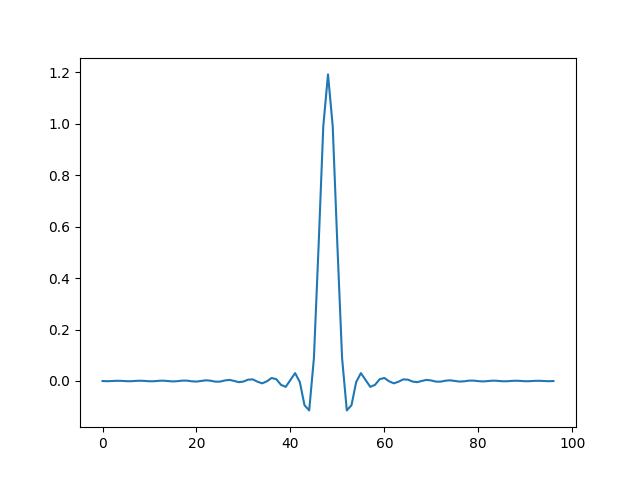
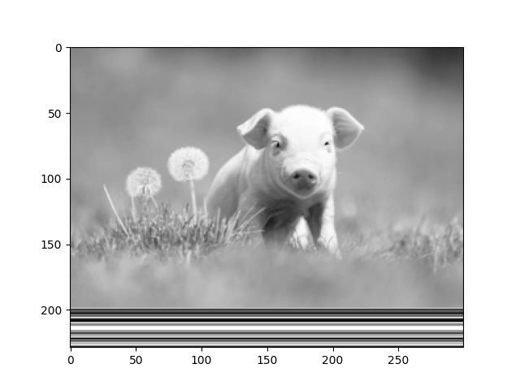
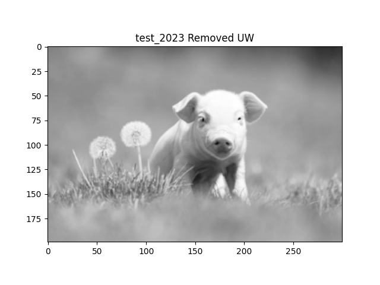
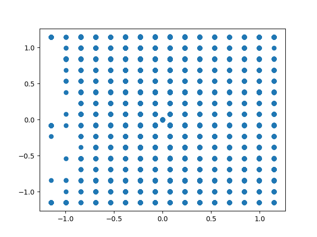
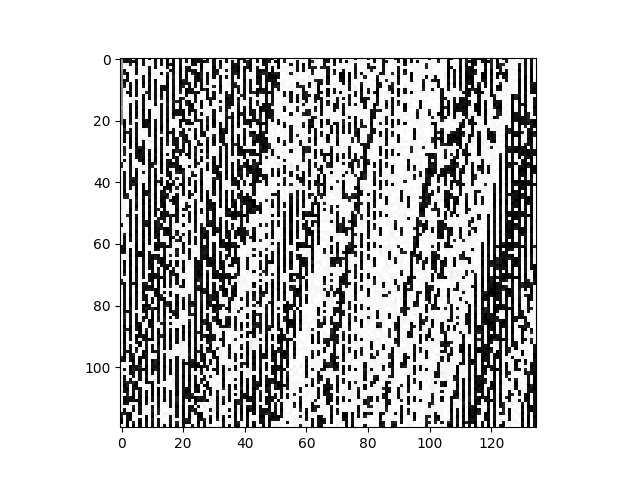
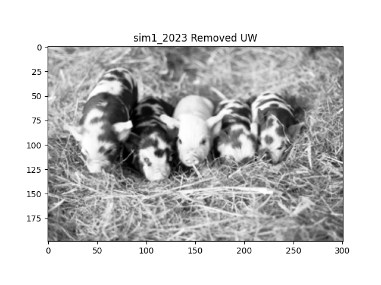
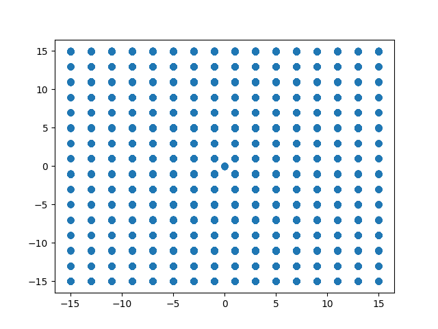

Calvin Passmore

ECE 5660

# Final Programming Project

I copied the pulse and LUT from the transmitting program

---

## test_2023

With UW | Without UW
:------:|:----------:
 | 

Recovered Constellation

---

## sim1_2023

With UW | Without UW
:------:|:----------:
 | 

Recovered Constellation

---

## Table of Parameters

Problem | K0 | Kp | K1 | K2 | BnT | Zeta | N 
:------:|:--:|:--:|:--:|:--:|:---:|:----:|:--:
