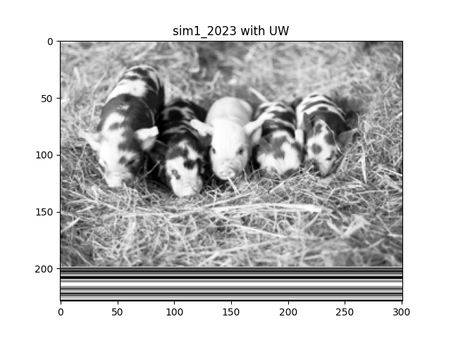
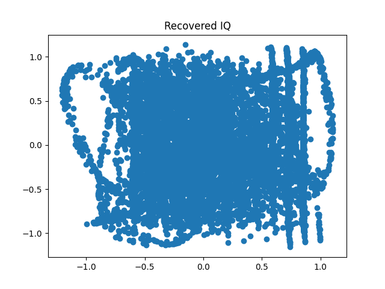

Calvin Passmore

ECE 5660

# Final Programming Project

I copied the pulse and LUT from the transmitting program

---

## test_2023

With UW | Without UW
:------:|:----------:
 | 

Recovered Constellation

---

## sim1_2023

With UW | Without UW
:------:|:----------:
 | 

Recovered Constellation

---

I didn't get any other images to generate, here are my plots of the I's and Q's I got followed by the code

### Sim2

### Sim3

### Sim4

### Sim5

