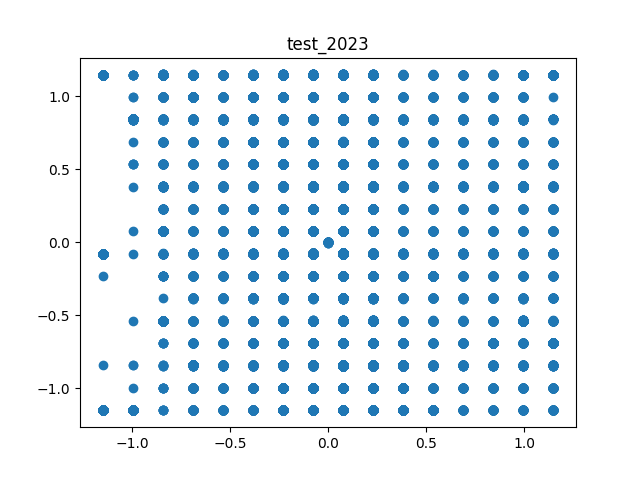
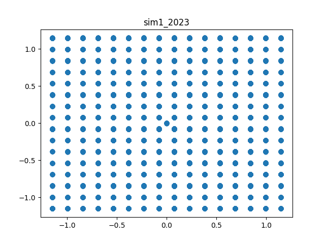
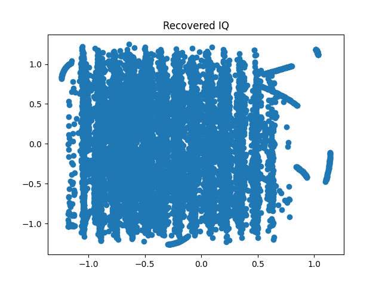
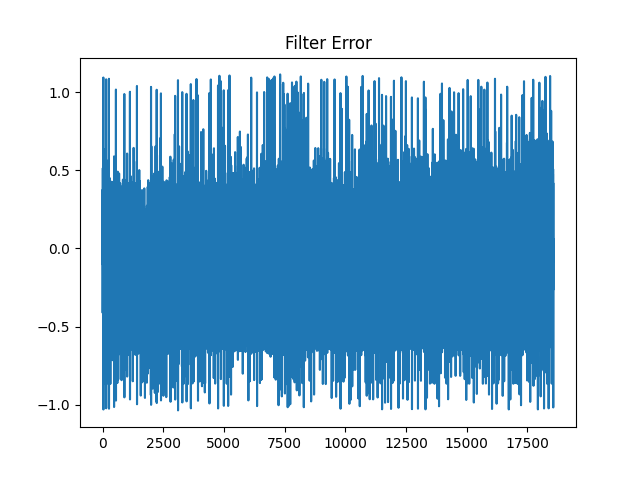
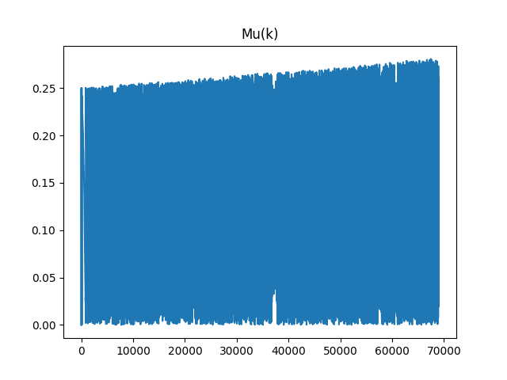

Calvin Passmore

ECE 5660

# Final Programming Project

I copied the pulse and LUT from the transmitting program


---

## test_2023

With UW | Without UW
:------:|:----------:
 | 

Recovered Constellation



---

## sim1_2023

With UW | Without UW
:------:|:----------:
 | 

Recovered Constellation



---

I didn't get any other images to generate, here are my plots of the I's and Q's I got followed by the code

### Sim2


### Sim3


### Sim4







### Sim5





## Code

### receiver.py

```python
import math
import numpy as np
import matplotlib.pyplot as plt
from tx_rx import *
from pulses import srrc1, slice_LUT, slice_LUT_get_symbols
from ted import TED
from pll import PLL
from interpolator import CubicInterpolator

image_folder = 'images'

input_file = 'sim4_2023'

Ts = 1 # Symbol period
N = 4
Lp = 12
alpha = 0.7
diff_filter_len = 11
diff_T = 1
pulse = srrc1(alpha,N,Lp)
Omega0 = math.pi/2

with open('data/' + input_file, 'r') as in_file:
    input_signal = [float(line) for line in in_file.readlines()]
    # print(input_signal)

rx = RX(
    signal=input_signal,
    # sample_time=N,
    sample_time=N,
    Lp=Lp,
    pulse=pulse,
    diff_filter_len=diff_filter_len,
    diff_T=diff_T,
    Omega0=Omega0)
I, Q = rx.get_sampled_signal()
Ip, Qp = rx.get_sampled_deriv()

# plt.figure()
# plt.stem(I)
# # plt.xlim([0, 500])
# plt.title("I")
# plt.savefig(f'{image_folder}/{input_file}_I.png', format='png')

assert len(I) == len(Q) == len(Ip) == len(Qp), f"RX Signal and Derivitive are not the same length {len(I)} {len(Q)} {len(Ip)} {len(Qp)}"

plt.figure()
plt.scatter(I, Q)
plt.title(f'{input_file}')
plt.savefig(f"{image_folder}/{input_file}_IQ_pre_tedandpll.png", format='png')

##############################
# No Tracking
##############################

# bits = []
# for i, q in zip(I,Q):
#     bits.append(slice_LUT(i,q))

##############################
# Tracking
##############################

# Interpolation
start_sample = 95
num_samples = 4
K0 = 1
Kp = -5.66
ted = TED(K0=K0, KP=Kp, num_samples=num_samples)
print(f'{ted.K1} {ted.K2}')
I_int = CubicInterpolator()
Q_int = CubicInterpolator()
Ip_int = CubicInterpolator()
Qp_int = CubicInterpolator()
I_results = [0]
Q_results = [0]
Ip_results = [0]
Qp_results = [0]
mus = []

# # PLL
# pll = PLL()
# theta = 0
# K = 1
# xt_prime = []
# yt_prime = []
# theta_hats = []
# delta_thetas = []
for idx in range(start_sample, len(I)):
    # New samples
    I_int.new_sample(I[idx])
    Q_int.new_sample(Q[idx])
    Ip_int.new_sample(Ip[idx])
    Qp_int.new_sample(Qp[idx])

    mu = ted.timing_error(I_results[-1], Q_results[-1], Ip_results[-1], Qp_results[-1])
    mus.append(mu)
    if ted.strobe:
        I_int.interpolate(mu); Q_int.interpolate(mu); Ip_int.interpolate(mu); Qp_int.interpolate(mu)
        # I_int.plot(f"I_int{idx-num_samples+1}-{idx}")
        I_results.append(I_int.get_result())
        Q_results.append(Q_int.get_result())
        Ip_results.append(Ip_int.get_result())
        Qp_results.append(Qp_int.get_result())

#     a0, a1 = slice_LUT_get_symbols(I[idx], Q[idx])
#     theta_hat = pll.pll(I[idx], Q[idx], a0, a1)
#     theta_hats.append(theta_hat)
#     # delta_thetas.append(theta_hat)
#     I_results.append(K * ((a0 * np.cos(theta_hat)) - (a1 * np.sin(theta_hat))))
#     Q_results.append(K * ((a0 * np.sin(theta_hat)) + (a1 * np.cos(theta_hat))))


I_results.pop(0)
Q_results.pop(0)
Ip_results.pop(0)
Qp_results.pop(0)

bits = []
for I, Q in zip(I_results, Q_results):
    bits.append(slice_LUT(I, Q))

# print(f"Length of bits {len(bits)}")

# Interpolation output figures
plt.figure()
plt.plot(mus)
plt.title("Mu(k)")
plt.savefig(f"{image_folder}/mus_{input_file}.png", format='png')

plt.figure()
plt.plot(ted.es)
plt.title("Filter Error")
plt.savefig(f"{image_folder}/e_{input_file}.png", format='png')

# # PLL output figures
# plt.figure()
# plt.plot(pll.error_signal)
# plt.title("PLL Error Signal")
# plt.savefig(f'{image_folder}/pll_error_{input_file}.png', format='png')

# plt.figure()
# plt.plot(theta_hats)
# plt.title("Theta Hat")
# plt.savefig(f'{image_folder}/pll_theta_hat_{input_file}.png', format='png')

# # General output figures
plt.figure()
plt.scatter(I_results, Q_results)
plt.title("Recovered IQ")
plt.savefig(f"{image_folder}/recovered_IQ_{input_file}.png", format='png')

##############################
# Bits to Image
##############################

num_conv_garbage = 17
for _ in range(num_conv_garbage):
    bits.pop(0)

num_bit_iter = 4
n_rows = ''
for idx in range(num_bit_iter):
    n_rows += f'{bits.pop(0):08b}'
# n_rows_dec = int(n_rows, 2)
# print(f'Number of rows binary: {n_rows}, length {len(n_rows)} decimal {n_rows_dec}')
n_cols = ''
for idx in range(num_bit_iter):
    n_cols += f'{bits.pop(0):08b}'
# n_cols_dec = int(n_cols, 2)
# print(f'Number of cols binary: {n_cols}, length {len(n_cols)} decimal {n_cols_dec}')
# FIXME: Remove the first bunch of points, should be the row and colum information
# for _ in range(25 - (num_bit_iter * 2)):
#     bits.pop(0)

# print(f'Rows {n_rows:08X}')
# print(f'Cols {n_cols:08X}')

unique_word = [162, 29, 92, 47, 16, 112, 63, 234, 50, 7, 15, 211, 109, 124, 239, 255, 243, 134, 119, 40, 134, 158, 182, 0, 101, 62, 176, 152, 228, 36]

# Split at the unique word
image = []
last_uw = 0
for idx in range(len(bits) - len(unique_word) + 1):
        if bits[idx : idx + len(unique_word)] == unique_word:
            image.append(bits[last_uw : idx + len(unique_word)])
            last_uw = idx + len(unique_word) + 1

# for row in image:
#     print(len(row))

# image = np.array([[0] * n_rows for _ in range(n_cols)])
# for row in range(n_rows):
#     for col in range(n_cols):
#         image[col][row] = slice_LUT(I.pop(0), Q.pop(0))

# if unique_word in image:
#     print('found')

with open(f'data/{input_file}_output.txt', 'w') as outfile:
    for row in image:
        outfile.write(str(row) + '\n')
# image = np.reshape(np.array(data), [n_cols, n_rows])
image = np.array(image).transpose()

if len(image) < 3: # Arbitrary number for error checking, should have more than this many sights of the UW
    print(f"Didn't find enough UWs")
    exit(1)

print(len(image))
print(len(image[0]))

plt.figure()
plt.imshow(255-image,cmap=plt.get_cmap('Greys'))
plt.title(f'{input_file} with UW')
plt.savefig(f'{image_folder}/{input_file}_image.png', format='png')

uw_remove = image[:-len(unique_word)]

plt.figure()
plt.imshow(255-uw_remove,cmap=plt.get_cmap('Greys'))
plt.title(f'{input_file} Removed UW')
plt.savefig(f'{image_folder}/{input_file}_image_removeuw.png', format='png')
```

### ted.py

```python
from numpy import sqrt
from interpolator import *

class TED:
    def __init__(self, K0=-1, KP=0.23, num_samples=4) -> None:
        self.strobe = 0
        self.mu = 0
        self.K1 = 0
        self.K2 = 0
        self.K0 = K0
        self.KP = KP
        self.BnT = 0.01
        self.Z = 1/sqrt(2)
        self.compute_K1_K2(self.BnT, self.Z, self.K0, self.KP)
        self.e = 0
        self.es = []
        self.loop_delay = 0
        self.aida = 0
        self.dec_delay = 1.5
        self.strobe = False
        self.num_samples = num_samples

    def compute_K1_K2(self, BnT, Z, K0, Kp):
        K0_Kp_K1 = (4 * Z * BnT / (Z + 1 / (4 * Z)))  / (1 + 2 * Z * BnT / (Z + 1 / (4 * Z)) + (BnT / (Z + 1 / (4 * Z)))**2)
        K0_Kp_K2 = (4 * (BnT / (Z + 1 / (4 * Z)))**2) / (1 + 2 * Z * BnT / (Z + 1 / (4 * Z)) + (BnT / (Z + 1 / (4 * Z)))**2)

        self.K1 = K0_Kp_K1 / (K0 * Kp)
        self.K2 = K0_Kp_K2 / (K0 * Kp)

    def loop_filter(self):
        self.v = (self.e * self.K1) + self.loop_delay
        self.loop_delay += self.e * self.K2

    def dec_mod_count(self):
        self.aida = self.dec_delay
        self.dec_delay -= self.v + (1/self.num_samples)
        if self.dec_delay <= 0:
            self.strobe = True
            self.dec_delay += 1
        else:
            self.strobe = False

    def compute_mu(self):
        if self.strobe:
            self.mu = (self.aida / (1 - self.aida + self.aida))

    def timing_error(self, I, Q, Ip, Qp):
        self.loop_filter()
        self.dec_mod_count()
        self.compute_mu()
        if self.strobe:
            self.e = (I * Qp) - (Q * Ip)
            self.es.append(self.e)
        else:
            self.e = 0

        return self.mu
```

### tx_rx.py

```python
import math
import numpy as np
from random import random
import matplotlib.pyplot as plt
from differentiate import Differentiator

class RX:
    def __init__(self, signal, sample_time, Lp, pulse, diff_filter_len, diff_T, Omega0) -> None:
        self.differentiator = Differentiator(diff_T, diff_filter_len)
        self.max_constellation_val = 1.15
        self.Omega0 = Omega0

        n = np.arange(len(signal))
        C =  math.sqrt(2)*np.cos(Omega0*n)
        S = -math.sqrt(2)*np.sin(Omega0*n)

        I = [signal[index] * C[index] for index in range(len(signal))]
        Q = [signal[index] * S[index] for index in range(len(signal))]
        
        # Matched Filter
        self.I_matched = self.matched_filter(I, pulse)
        self.Q_matched = self.matched_filter(Q, pulse)

        # Differentiating and Delaying
        self.differentiator.differentiate(self.I_matched)
        self.I_deriv, self.I_delay = self.differentiator.get_result()
        self.differentiator.differentiate(self.Q_matched)
        self.Q_deriv, self.Q_delay = self.differentiator.get_result()
        
        # Sampling and Normalizing
        delay_time = int((diff_filter_len - 1) / 2)
        self.I_delay_sample = self.sample_signal(self.I_delay, delay_time, sample_time, Lp)
        self.Q_delay_sample = self.sample_signal(self.Q_delay, delay_time, sample_time, Lp)
        self.I_delay_normal = self.normalize_amplitude(self.I_delay_sample, self.max_constellation_val)
        self.Q_delay_normal = self.normalize_amplitude(self.Q_delay_sample, self.max_constellation_val)

        self.I_deriv_sample = self.sample_signal(self.I_deriv, delay_time, sample_time, Lp)
        self.Q_deriv_sample = self.sample_signal(self.Q_deriv, delay_time, sample_time, Lp)
        self.I_deriv_normal = self.normalize_amplitude(self.I_deriv_sample, self.max_constellation_val)
        self.Q_deriv_normal = self.normalize_amplitude(self.Q_deriv_sample, self.max_constellation_val)

    def get_sampled_signal(self):
        return self.I_delay_normal, self.Q_delay_normal

    def get_sampled_deriv(self):
        return self.I_deriv_normal, self.Q_deriv_normal
    
    def plot_sampled_signal(self, file_name='rx_sampled.png', format='png'):
        plt.figure()
        plt.subplot(2,1,1)
        plt.title("Received Samples")
        plt.stem(self.I_delay_normal)
        plt.ylabel("I")
        plt.subplot(2,1,2)
        plt.ylabel("Q")
        plt.stem(self.Q_delay_normal)
        plt.savefig(file_name, format=format)

    def sample_signal(self, sig, delay_time, sample_time, Lp=0):
        sampled = []
        # for idx in range(Lp,len(sig)-Lp,sample_time):
        for idx in range(delay_time, len(sig) - Lp, sample_time):
            sampled.append(sig[idx])
        return sampled

    def normalize_amplitude(self, signal, max_constellation_val):
        max_sig = max(max(signal),abs(min(signal)))
        return [i * max_constellation_val / max_sig for i in signal]

    def slice_QPSK(self, x, y):
        """Slices a single QPSK point"""
        a0 = 0 if x < 0 else 1
        a1 = 0 if y < 0 else 1
        return [a0, a1]

    def matched_filter(self, signal, pulse):
        pulse_reversed = list(reversed(pulse))
        return np.convolve(signal, pulse_reversed)
```

### differentiate.py

```python
from numpy import linspace, pi, sin, cos, convolve
import matplotlib.pyplot as plt

class Differentiator:
    def __init__(self, T, filter_len = 11) -> None:
        self.filter_len = filter_len
        self.L = int((self.filter_len - 1) / 2)
        self.T = T
        self.inputs = [0] * filter_len
        self.indeces = list(range(-self.L, self.L + 1))
        self.deriv_filter = []
        self.delay_filter = []
        self.deriv = []
        self.make_filter()
        assert len(self.deriv_filter) == self.filter_len, f'Expected: {self.filter_len}, Actual {len(self.deriv_filter)}'

    def make_filter(self):
        for n in self.indeces:
            if n == 0:
                self.deriv_filter.append(0)
            else:
                self.deriv_filter.append(((-1)**n)/(self.T * n))
        self.delay_filter = [0] * self.filter_len
        self.delay_filter[self.L] = 1
    
    def plot_filter(self):
        plt.figure()
        plt.subplot(2,1,1)
        plt.title("Derivitive and Delay Filter")
        plt.ylabel("Derivitive")
        plt.stem(self.indeces, self.deriv_filter)
        plt.subplot(2,1,2)
        plt.ylabel("Delay")
        plt.stem(self.indeces, self.delay_filter)
        plt.savefig(f"diff_filters.png", format='png')

    def get_result(self):
        return self.deriv, self.delayed

    def differentiate(self, signal):
        self.deriv = convolve(signal, self.deriv_filter)
        self.delayed = convolve(signal, self.delay_filter)

if __name__ == '__main__':
    T = 1
    diff = Differentiator(T, filter_len=11)
    diff.plot_filter()
    for w0 in [pi/10, pi/5, pi/20]:
        num_points = 100
        spacing = range(0, num_points)
        A = 1
        signal = [A * sin(w0*t) for t in spacing]

        diff.differentiate(signal)
        deriv, delay = diff.get_result()

        plt.figure()
        plt.title(f"Differentiator for {w0}")
        plt.plot(delay)
        plt.plot(deriv)
        plt.legend(["Sin Input", "Differentiator Ouput"])
        plt.savefig(f"diff_{w0}.png", format='png')

        min_index = list(delay).index(min(delay))
        print(f"Value of deriv at minimum delay {deriv[min_index]}")

        min_index = list(deriv).index(min(deriv))
        print(f"Value of delay at minimum deriv {delay[min_index]}")
```

### interpolator.py

```python
from numpy import sin, pi, linspace
import matplotlib.pyplot as plt

class Interpolator:
    def __init__(self) -> None:
        self.samples = [0] * 4
        self.interpolated_val = 0
        self.color = 'blue'
        self.name = "None"
        self.list_of_vals = []
        self.mu = 0

    def interpolate(self, mu=None):
        """If no mu is given, mu coefficients will not be updated"""
        assert False, "Didn't Overwrite function"

    def new_sample(self, sample):
        #Shift the samples down and insert the new sample
        for index in reversed(range(len(self.samples))):
            if index == 0:
                self.samples[0] = sample
            else:
                self.samples[index] = self.samples[index - 1]

    def calc_mu_coefficients(self, mu):
        assert False, "Didn't Overwrite function"

    def get_result(self):
        return self.interpolated_val

    def store_val(self, val):
        self.list_of_vals.append(val)

    def plot(self, file_name, format='png'):
        plt.figure()
        plt.title(file_name.split('.')[0])
        plt.stem(list(reversed(self.samples)))
        plt.scatter(1 + self.mu, self.interpolated_val, edgecolors='red')
        plt.show()

class CubicInterpolator(Interpolator):
    def __init__(self) -> None:
        super().__init__()
        self.coefficients = [0] * 4
        self.exponents = [3,2,1,0]
        self.b_coef = [
            [1/6,  0,   -1/6, 0],
            [-1/2, 1/2, 1,    0],
            [1/2,  -1,  -1/2, 1],
            [-1/6, 1/2, -1/3, 0]
        ]
        self.color = 'green'
        self.name = "Cubic"

    def interpolate(self, mu=None):
        if mu != None:
            self.calc_mu_coefficients(mu)
        self.interpolated_val = 0
        for index in range(len(self.samples)):
            self.interpolated_val += self.samples[index] * self.coefficients[index]
        return self.interpolated_val

    def calc_mu_coefficients(self, mu):
        self.mu = mu
        for i in range(len(self.coefficients)):
            self.coefficients[i] = 0
            for l in range(len(self.b_coef)):
                self.coefficients[i] += (mu**self.exponents[l]) * self.b_coef[i][l]
        self.coefficients = list(reversed(self.coefficients))

class LinearInterpolator(Interpolator):
    def __init__(self, num_samples=4) -> None:
        super().__init__()
        self.coefficients = [0]*2
        self.color = 'purple'
        self.name = "Linear"
        self.samples = [0] * num_samples

    def calc_mu_coefficients(self, mu):
        self.mu = mu
        self.coefficients[0] = 1 - mu
        self.coefficients[1] = mu
        # print(f"coef[0] = {self.coefficients[0]} coef[1] = {self.coefficients[1]}")

    def interpolate(self, mu=None):
        if mu != None:
            self.calc_mu_coefficients(mu)
        self.interpolated_val = 0
        print(f"samples x(mk) = {self.samples[1]}, x(mk+1) = {self.samples[2]}")
        print(f"mu = {mu}")
        half_way_index = int(len(self.samples) / 2) - 1
        for index in range(len(self.coefficients)):
            self.interpolated_val += self.samples[half_way_index + index] * self.coefficients[index]
        return self.interpolated_val


if __name__ == '__main__':
    F0 = 1
    T = 0.15 / F0
    spacing = linspace(0,0.5,1000)
    signal = [sin(2*pi*F0*t) for t in spacing]

    mus = linspace(0, 1, 13)
    mu_spacing = [(mu * T) + T for mu in mus]

    sample_times = [3*T, 2*T, T, 0]
    interpolators = [CubicInterpolator(), LinearInterpolator()]
    for interpolator in interpolators:
        for mu in mus:
            for t in sample_times:
                interpolator.new_sample(sin(2*pi*t))
            # TODO: This needs to go over 11 points for mu
            val = interpolator.interpolate(mu)
            interpolator.store_val(val)

    plt.figure()
    plt.plot(spacing, signal)
    plt.title("Interpolators")
    plt.stem(list(reversed(sample_times)), interpolators[0].samples)
    for interp in interpolators:
        plt.plot(mu_spacing, interp.list_of_vals, markerfacecolor=interp.color, markeredgecolor=interp.color)
    plt.legend(["Signal"] + [interp.name for interp in interpolators])
    plt.savefig("interpolators.png", format='png')
```

### pll.py

```python
from math import sqrt, pi, cos, sin, atan2

class PLL:
    def __init__(self) -> None:
        self.BnT = 0.5
        self.Z = 1 / sqrt(2)
        self.Kp = 1
        self.K0 = 5.66
        self.compute_K1_K2(self.BnT, self.Z, self.K0, self.Kp)
        self.Omega_n = 1e9
        self.A = 1
        self.delayed_k2 = 0
        self.delayed_dds = 0
        self.theta_hat = 130
        self.error_signal = []

    def compute_K1_K2(self, BnT, Z, K0, Kp):
        K0_Kp_K1 = (4 * Z * BnT / (Z + 1 / (4 * Z)))  / (1 + 2 * Z * BnT / (Z + 1 / (4 * Z)) + (BnT / (Z + 1 / (4 * Z)))**2)
        K0_Kp_K2 = (4 * (BnT / (Z + 1 / (4 * Z)))**2) / (1 + 2 * Z * BnT / (Z + 1 / (4 * Z)) + (BnT / (Z + 1 / (4 * Z)))**2)

        self.K1 = K0_Kp_K1 / (K0 * Kp)
        self.K2 = K0_Kp_K2 / (K0 * Kp)

    def pll(self, x, y, a0, a1):
        theta_error = cos(atan2(x, y)) * -sin(atan2(a0, a1))
        self.error_signal.append(theta_error)
        return theta_error

        # Loop Filter
        self.delayed_k2 = (theta_error * self.K2) + self.delayed_k2
        v = self.delayed_k2 + (theta_error * self.K1)

        # DDS
        self.theta_hat = self.delayed_dds
        self.delayed_dds = -self.delayed_dds + (self.K0 * v)
        return cos(self.theta_hat) + (pi/4)
```

### pulses.py

```python
import numpy as np
import math
import matplotlib.pyplot as plt

def srrc1(alpha, N, Lp):
    """
    Return a vector of the srrc function
    alpha = excess bandwidth
    N = samples per symbol
    Lp = SRRC truncation length #Currently only supports even numbers
    """

    EB = alpha

    t = np.arange(-Lp*N,Lp*N+1) /N + 1e-8; # +1e-8 to avoid divide by zero
    tt = t
    srrc = ((np.sin(math.pi*(1-EB)*tt)+ 4*EB*tt * np.cos(math.pi*(1+EB)*tt))/((math.pi*tt)*(1-(4*EB*tt)**2)))
    srrc = srrc/math.sqrt(N)
    return srrc

B = 8
bits2index = 2**np.arange(B-1,-1,-1)
M = 2 ** B # Number of symbols in the constellation
Mroot = math.floor(2**(B/2))
a = np.reshape(np.arange(-Mroot+1,Mroot,2),(2*B,1))
b = np.ones((Mroot,1))
LUT = np.hstack((np.kron(a,b), np.kron(b,a)))
Enorm = np.sum(LUT ** 2) / M
LUT = LUT/math.sqrt(Enorm)

# plt.figure(1)
# # Plot the constellation
# plt.plot(LUT[:,0],LUT[:,1],'o');
# for i in range(0,M):
#     plt.text(LUT[i,0]+0.02,LUT[i,1]+.02,i)
# # grid on; axis((max(axis)+0.1/B)*[-1 1 -1 1]); axis square;
# plt.xlabel('In-Phase')
# plt.ylabel('Quadrature')
# plt.title('Constellation Diagram');
# plt.show()

def slice_LUT(I, Q):
    distances = []
    for index in range(len(LUT)):
        distances.append(math.sqrt((LUT[index][0] - I)**2 + (LUT[index][1] - Q)**2))
    min_index = distances.index(min(distances))
    return min_index

def slice_LUT_get_symbols(I, Q):
    value = slice_LUT(I, Q)
    a1 = value & 0xFFFF
    a0 = (value >> 32) & 0xFFFF
    return LUT[a0][1], LUT[a1][1]
```