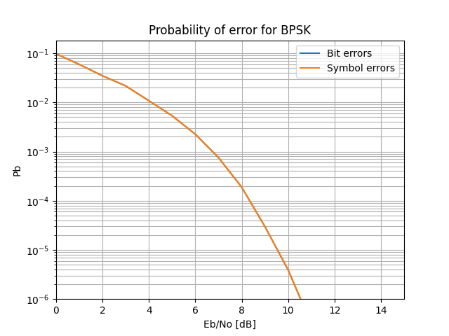
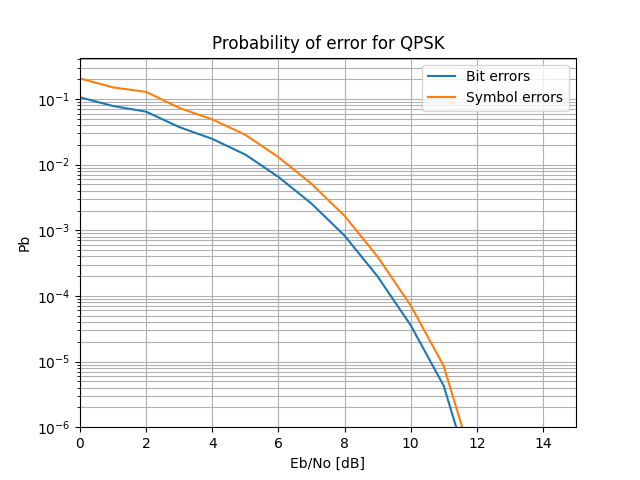
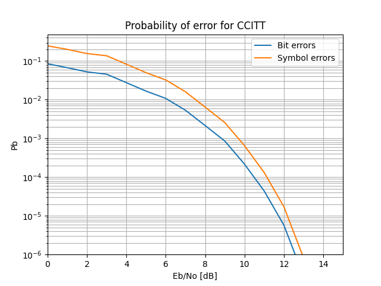
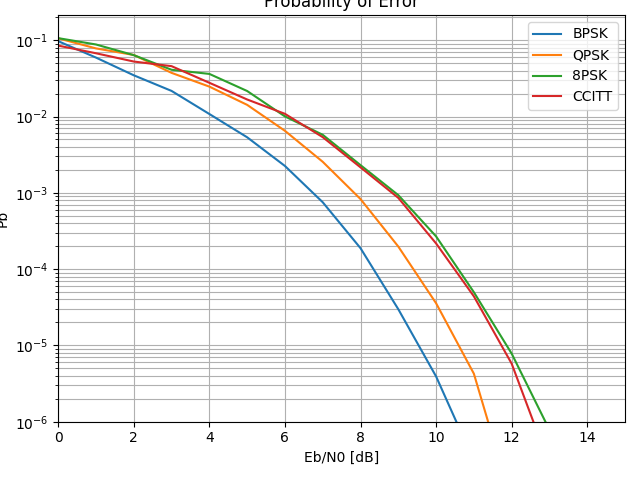

Calvin Passmore

ECE 5660

# Homework 4


## Problem 1

With reference to the MSK document, write (in good, correct English) re-
sponses to the following questions:

(a) Write What is frequency shift keying? What is binary frequency shift keying? (Carefully describe!)

(b) What is the minimum frequency separation ∆F which gives orthogonal signals? Work through the derivation on pp. 2–3 to explain why.

(c) Explain carefully why is it desirable to have continuous phase.

(d) Explain carefully how MSK achieves continuity of phase.

(e) Work through the derivation of the formula θn = θn−1 + an−1π/2 in Eq (3). (show the calculations in the derivation)

(f) Work through the steps to derive Eq (8).

(g) How is MSK both linear and nonlinear modulation?

---

(a) Frequency Shift Keying is where a change in the carrier frequency indicates a symbol. So the waveform is a carrier with changing frequency, as opposed to changing amplitude such as in PAM.

Binary FSK is where the two bits correspond to a change in frequency delta_F such that representing a 1 means adding delta_F to the nominal frequency F_c and a 0 means subtracting delta_F from F_c.

s(t) = A cos[2 &pi; (F<sub>c</sub> &plusmn; &Delta;<sub>F</sub>)t]

(b) The minimum frequency separation = 1 / (4 * T<sub>b</sub>) = R<sub>b</sub> / 4. This is because the condition for orthogonality in continuous time is the integral of the two signals must be 0 over the period. Solving the integral gives sin(2 &pi; (F<sub>i</sub>-F<sub>j</sub>)T<sub>b</sub>) = 0. sin(x) = 0 when x = k&pi; so 2 &pi; (F<sub>i</sub>-F<sub>j</sub>)T<sub>b</sub> = k &pi;. We only need one point of the pi circle so choose k=1. Solving the remaining equation gives F<sub>i</sub>-F<sub>j</sub> = 1 / (2 * T<sub>b</sub>).

Then &Delta;<sub>F</sub> = (F<sub>1</sub>-F<sub>0</sub>) / 2 = 1 / (4 * T<sub>b</sub>) = R<sub>b</sub> / 4

(c) With continuous phase, the signal avoids sharp changes and the start of one symbol aligns with the next symbol. This reduces the necessary bandwidth to transmit the signal.

(d) MSK achieves continuity of phase by adding or subtracting phase based on the previous phase, and the amplitude of the previous symbol. This way the phase matches the previous phase shifted by its phase shift, equaling them out and creating the continuity.

&Theta;<sub>n</sub> = &Theta;<sub>n-1</sub> + a<sub>n-1</sub>&pi;/2

(e) At any instant t = (n + 1)T<sub>b</sub>

2&pi;a<sub>n</sub>R<sub>b</sub>/4 (t - nT<sub>b</sub>) + &Theta;<sub>n</sub> | <sub>t=(n+1)T<sub>b</sub></sub> = 2&pi;a<sub>n</sub>R<sub>b</sub>/4 (t - (n+1)T<sub>b</sub>) + &Theta;<sub>n+1</sub> | <sub>t=(n+1)T<sub>b</sub></sub>

2&pi;a<sub>n</sub>R<sub>b</sub>/4 ((n + 1)T<sub>b</sub> - nT<sub>b</sub>) + &Theta;<sub>n</sub> = 2&pi;a<sub>n</sub>R<sub>b</sub>/4 ((n + 1)T<sub>b</sub> - (n+1)T<sub>b</sub>) + &Theta;<sub>n+1</sub> 

2&pi;a<sub>n</sub>/4T<sub>b</sub> (T<sub>b</sub>) + &Theta;<sub>n</sub> = 2&pi;a<sub>n</sub>R<sub>b</sub>/4 (0) + &Theta;<sub>n+1</sub>

&pi;a<sub>n</sub>/2 + &Theta;<sub>n</sub> = &Theta;<sub>n+1</sub>

&Theta;<sub>n+1</sub> = &Theta;<sub>n</sub> + a<sub>n</sub>&pi;/2

This is non-causal, by reaching into the next symbol. To write it causally, shift n by 1.

&Theta;<sub>n</sub> = &Theta;<sub>n-1</sub> + a<sub>n-1</sub>&pi;/2

(f)

s(t) = cos[2&pi; F<sub>c</sub>t + 2&pi; a<sub>n</sub>R<sub>b</sub>/4 (t - nT<sub>b</sub>) + &Theta;<sub>n</sub>]

= cos[2&pi; F<sub>c</sub>t + 2&pi; a<sub>n</sub>R<sub>b</sub>/4 t - na<sub>n</sub>&pi;/2 + &theta;<sub>n</sub>] where na<sub>n</sub>&pi;/2 + &theta;<sub>n</sub> = &Theta;<sub>n</sub>

&Theta;<sub>n</sub> = &theta;<sub>n</sub> - na<sub>n</sub>&pi;/2

= &theta;<sub>n-1</sub> + a<sub>n-1</sub>&pi;/2 - na<sub>n</sub>&pi;/2

= &theta;<sub>n-1</sub> - a<sub>n-1</sub>(1-n+n)&pi;/2 - na<sub>n</sub>&pi;/2

= &theta;<sub>n-1</sub>-(n-1)a<sub>n-1</sub>&pi;/2+n&pi;/2(a<sub>n-1</sub>-a<sub>n</sub>)

= &theta;<sub>n-1</sub> + n &pi;/2 (a<sub>n-1</sub>-a<sub>n</sub>)

so when a<sub>n</sub> &ne; a<sub>n-1</sub> and when <i>n</i> is odd, then &Theta;<sub>n</sub> = &Theta;<sub>n-1</sub> &pm; &pi;, and &Theta;<sub>n-1</sub> otherwise

So now

s(t) = cos[2&pi; F<sub>c</sub>t + 2&pi; a<sub>n</sub>R<sub>b</sub>/4 (t - nT<sub>b</sub>) + &Theta;<sub>n</sub>]

= cos(2&pi;F<sub>c</sub>t)cos(2&pi; a<sub>n</sub>R<sub>b</sub>/4t + &Theta;<sub>n</sub>) - sin(2&pi;F<sub>c</sub>t)sin(2&pi; a<sub>n</sub>R<sub>b</sub>/4t + &Theta;<sub>n</sub>)

cos(2&pi; a<sub>n</sub>R<sub>b</sub>/4t + &Theta;<sub>n</sub>)

= cos(2&pi; a<sub>n</sub>R<sub>b</sub>/4t)cos&Theta;<sub>n</sub> - sin(2&pi; a<sub>n</sub>R<sub>b</sub>/4t)sin&Theta;<sub>n</sub>

= cos(2&pi; a<sub>n</sub>R<sub>b</sub>/4t)cos&Theta;<sub>n</sub>

= d <sub>I, n</sub>cos2&pi;R<sub>b</sub>t/4 where d <sub>I, n</sub> = cos&Theta;<sub>n</sub>

similarly 

sin(2&pi; a<sub>n</sub>R<sub>b</sub>/4t + &Theta;<sub>n</sub>)

= sin(2&pi; a<sub>n</sub>R<sub>b</sub>t/4)cos&Theta;<sub>n</sub> + cos(2&pi; a<sub>n</sub>R<sub>b</sub>t/4)sin&Theta;<sub>n</sub>

= sin(2&pi; a<sub>n</sub>R<sub>b</sub>t/4)cos&Theta;<sub>n</sub>

= cos&Theta;<sub>n</sub> &dot; a<sub>n</sub>sin2&pi;R<sub>b</sub>t/4

= -d<sub>Q, n</sub>sin2&pi;R<sub>b</sub>t/4 where -d<sub>Q, n</sub> = -a<sub>b</sub>cos&Theta;<sub>n</sub> = -a<sub>n</sub>d <sub>I, n</sub>

plugging both d's into s(t) gives

s(t) = d<sub>I, n</sub>cos(2&pi; a<sub>n</sub>R<sub>b</sub>t/4) cos(2&pi;F<sub>c</sub>t) + d<sub>Q, n</sub>sin(2&pi; a<sub>n</sub>R<sub>b</sub>t/4) sin(2&pi;F<sub>c</sub>t)

using sin &alpha; = cos(&alpha; - &pi;/2)

s(t) = d<sub>I, n</sub>cos(2&pi; a<sub>n</sub>R<sub>b</sub>t/4) cos(2&pi;F<sub>c</sub>t) + d<sub>Q, n</sub>cos(2&pi; a<sub>n</sub>R<sub>b</sub>t/4 - &pi;/2) sin(2&pi;F<sub>c</sub>t)

= d<sub>I, n</sub>cos(2&pi; a<sub>n</sub>R<sub>b</sub>t/4) cos(2&pi;F<sub>c</sub>t) + d<sub>Q, n</sub>cos2&pi; a<sub>n</sub>R<sub>b</sub>t/4(t-T<sub>b</sub>)sin(2&pi;F<sub>c</sub>t)

(g) In reality MSK in a nonlinear modulation scheme for a<sub>n</sub>. It is only from the viewpoint of d<sub>n</sub> that MSK can be seen as linear modulation, seeing it as OQPSK.

---
---

## Problem 2

With reference to the standards documents: Pick one of the standards and
write a brief description (e.g., at least two pages typed) of what the standard is about and briefly describe the major operational blocks in the system.

---

See attached document

---
---

## Problem 3

(a)

See the attached code. For each constellation type, the LUT, symbol energy, parallel to serial, and slicing had to be done individually. The algorithm to simulate the bits was put into a parent class so that each child class could use the features and data points directly.

(b)



This is comparable to Figure 6.1.3 in the book. The image in the book seems to be more smooth, indicating they likely used more points to plot it, the points lie in the same general area.

The symbol errors are exactly the same as the bit errors, so only one plot is visible on the graph even though both are plotted. This is due to the one-to-one mapping of symbols to bits in BPSK.

(c)




These plots are comparable to the ones in the book, there is a slight variation from what is in the book, and with low Eb/N0 it isn't a very smooth graph.

(d)


The plots are essentially the same as the ones in the book. There is slight variation due to the randomness of the simulation and the fact the book seems to use more plot points, providing a more smooth and more accurate curve.

(f)



This plot is essentially the same as the book. There is a slight variation due to the randomness of the simulation.

Just for fun, I plotted all of the bit errors together as well. (For some reason the 'savefigure' function in this case cropped it funny)



## Code

```py
from math import sqrt, cos, sin, floor, ceil
import numpy as np
from numpy.random import rand
import matplotlib.pyplot as plt
import copy

class SignalSpace:
    Es = 0
    Eb = 0
    A = 0
    std_dev = 0
    LUT = []
    bits_per_symbol = 0
    num_axis = 0
    name = "SignalSpace"
    bit_errs = []
    sym_errs = []

    def __init__(self) -> None:
        pass

    def set_symbol_energy(self):
        print("NO GOOD! WASN'T OVERWRITTEN")

    def random_noise(self, std_dev):
        return np.random.normal(loc=0, scale=std_dev)

    def bits_to_amp(self, bits:list):
        """bits is the parallelized version of the bits (as integers)"""
        print("NO GOOD! WASN'T OVERWRITTEN")

    def simulate_single_symbol(self, std_dev, bits):
        """std_dev is the calculated standard deviation and bits is one symbol worth of bits, returns number of bit errors and symbol errors"""
        assert len(bits) == self.bits_per_symbol
        sym = self.bits_to_amp(bits)
        sym = [amp + self.random_noise(std_dev) for amp in sym] # Add noise
        bits_hat = self.slice(sym)
        bit_err = 0
        sym_err = 0
        for idx in range(len(bits)):
            if bits_hat[idx] != bits[idx]:
                bit_err += 1
                sym_err = 1 # we want to max out at 1 per call to the function
        return bit_err, sym_err

    def slice(self, symbol):
        """Turns a single symbol into the closest bits"""
        print("NO GOOD! WASN'T OVERWRITTEN")
    
    def set_LUT(self):
        """Adjusts the LUT for the given amplitudes"""
        print("NO GOOD! WASN'T OVERRITTEN")

    def plot(self):
        """Plot and save the data"""
        plt.figure()
        plt.clf()
        plt.plot(self.bit_errs)
        plt.plot(self.sym_errs)
        plt.grid(which='both', axis='both')
        plt.yscale('log')
        plt.xlabel("Eb/No [dB]")
        plt.xlim(0, 15)
        plt.ylabel("Pb")
        plt.ylim(1e-6, 0)
        plt.title(f"Probability of error for {self.name}")
        plt.legend(["Bit errors", "Symbol errors"])
        plt.savefig(f"{self.name}.png")

    def simulate(self, dBRangeStart=0, dBRangeEnd=15, Eb=1, ErrCountTarget=1e2, ErrStopLimit=1e-6):
        self.bit_errs = []
        self.sym_errs = []
        for SNRdB in range(dBRangeStart,dBRangeEnd+1):
            SNR = 10**(SNRdB/10)
            N0 = Eb/SNR
            sigma = sqrt(N0/2)
            # print(sigma)
            bit_err_count = 0
            sym_err_count = 0
            sym_count = 0
            while bit_err_count < ErrCountTarget:
                # print(bit_err_count)
                bits = (rand(self.bits_per_symbol)>0.5).astype(int)
                # print(bits)
                bit_err, sym_err = self.simulate_single_symbol(sigma, bits)
                bit_err_count += bit_err
                sym_err_count += sym_err
                sym_count += 1
                if bit_err_count > 1 and (bit_err_count/(sym_count * self.bits_per_symbol)) < ErrStopLimit:
                    break
                print(f"\033[K{self.name:5} SNRdB [{SNRdB}/{dBRangeEnd}] Error Count [{bit_err_count}/{ErrCountTarget}] {bit_err_count/(sym_count * self.bits_per_symbol)}", end='\r')
            self.bit_errs.append(bit_err_count/(sym_count * self.bits_per_symbol))
            self.sym_errs.append(sym_err_count/sym_count)
            # print(f"\n{self.bit_errs[-1]}")

            if self.bit_errs[-1] < ErrStopLimit:
                break
        print("")
        self.plot()
        with open(f"{self.name}_bit.dat", 'w') as w:
            for item in self.bit_errs:
                w.write(f"{item}\n")
        with open(f"{self.name}_sym.dat", 'w') as w:
            for item in self.sym_errs:
                w.write(f"{item}\n")
        

class BPSK(SignalSpace):
    def __init__(self, Eb=1) -> None:
        super().__init__()
        self.name = "BPSK"
        self.bits_per_symbol = 1
        self.num_axis = 1
        self.Eb = Eb
        self.set_symbol_energy()

    def set_LUT(self):
        self.LUT = [[-self.A], [self.A]]
        # print(f"LUT: {self.LUT} A:{self.A}")

    def set_symbol_energy(self):
        self.Es = self.Eb
        self.A = sqrt(self.Es)
        self.set_LUT()

    def bits_to_amp(self, bits: list):
        assert len(bits) == 1, f"BPSK can only take len 1 bits at a time, received len {len(bits)}"
        return copy.deepcopy(self.LUT[bits[0]])

    def slice(self, symbol):
        if symbol[0] >= 0:
            return [1]
        else:
            return [0]

class QPSK(SignalSpace):
    def __init__(self, Eb=1) -> None:
        super().__init__()
        self.bits_per_symbol = 2
        self.name = "QPSK"
        self.num_axis = 2
        self.Eb = Eb
        self.set_symbol_energy()

    def set_LUT(self):
        self.LUT = [[self.A, self.A], [self.A, -self.A], [-self.A, self.A], [-self.A, -self.A]]

    def set_symbol_energy(self):
        self.Es = self.Eb *1.25
        self.A = self.Es / sqrt(2)
        self.set_LUT()

    def bits_to_amp(self, bits: list):
        assert len(bits) == self.bits_per_symbol
        val = bits[0] << 1 | bits[1]
        return copy.deepcopy(self.LUT[val])

    def slice(self, symbol):
        assert len(symbol) == self.bits_per_symbol
        bits = []
        if symbol[0] >= 0:
            bits.append(0)
        else:
            bits.append(1)
        
        if symbol[1] >= 0:
            bits.append(0)
        else:
            bits.append(1)

        return bits

class EightPSK(SignalSpace):
    def __init__(self, Eb=1) -> None:
        super().__init__()
        self.bits_per_symbol = 3
        self.name = "8PSK"
        self.num_axis = 2
        self.Eb = Eb
        self.set_symbol_energy()

    def set_LUT(self):
        A = self.A
        for theta in [5*np.pi/4, np.pi, np.pi/2, 3*np.pi/4, 3*np.pi/2, 7*np.pi/4, np.pi/4, 0]:
            self.LUT.append([A * cos(theta), A * sin(theta)])

    def set_symbol_energy(self):
        self.Es = 3 * self.Eb
        self.A = (-1 + sqrt(1 - 4 * (-6 * self.Eb))) / 2
        self.set_LUT()

    def bits_to_amp(self, bits: list):
        assert len(bits) == self.bits_per_symbol
        val = (bits[0] << 2) | (bits[1] << 1) | (bits[2] << 0)
        return copy.deepcopy(self.LUT[val])

    def slice(self, symbol):
        distances = []
        for look in self.LUT:
            distances.append(sqrt((symbol[0] - look[0])**2) + (symbol[1] - look[1])**2)
        sym_hat = distances.index(min(distances))
        return [(sym_hat >> 2) & 1, (sym_hat >> 1) & 1, sym_hat & 1]

class CCITT(SignalSpace):
    def __init__(self, Eb=1) -> None:
        super().__init__()
        self.name = "CCITT"
        self.bits_per_symbol = 3
        self.num_axis = 2
        self.Eb = Eb
        self.set_symbol_energy()

    def set_LUT(self):
        A = self.A
        self.LUT = [[2*A, 0], [0, 2*A], [-2*A, 0], [0, -2*A], [A, A], [-A, A], [-A, -A], [A, -A]]
    
    def set_symbol_energy(self):
        self.Es = 3 * self.Eb
        self.A = self.Es / (1 + sqrt(2))

    def bits_to_amp(self, bits: list):
        assert len(bits) == self.bits_per_symbol
        val = (bits[0] << 2) | (bits[1] << 1) | (bits[2])
        return copy.deepcopy(self.LUT[val])

    def slice(self, symbol):
        distances = []
        for look in self.LUT:
            distances.append(sqrt((symbol[0] - look[0])**2 + (symbol[1] - look[1])**2))
        sym_hat = distances.index(min(distances))
        return [(sym_hat >> 2) & 1, (sym_hat >> 1) & 1, sym_hat & 1]

# signal_spaces = [QPSK()]
signal_spaces = [BPSK(), QPSK(), EightPSK(), CCITT()]

for signal_space in signal_spaces:
    signal_space.simulate(dBRangeStart=0, dBRangeEnd=15, ErrCountTarget=1e2, ErrStopLimit=1e-6)

plt.figure()
plt.clf()
for space in signal_spaces:
    plt.plot(space.bit_errs)
plt.grid(which='both', axis='both')
plt.yscale('log')
plt.xlabel("Eb/N0 [dB]")
plt.xlim(0,15)
plt.tight_layout()
plt.ylabel("Pb")
plt.ylim(1e-6, 0)
plt.title("Probability of Error")
plt.legend([space.name for space in signal_spaces])
plt.savefig('joined.png')
```