Calvin Passmore

ECE 5660

# Homework 7

## Problem 1

### 8.5

```m
%% Problem 8.5

syms m mu xm xmp1 T

A = [
    m*T 1;
    (m-1)*T 1
    ];

b = [ xm; xmp1 ];

cs = inv(A)*b;
disp(cs)
```

gives the output

```
      xm/T - xmp1/T
m*xmp1 - xm*(m - 1)
```

reording and substituting gives

```
mu *xmp1 + (1-mu)*xm
```

### 8.6

```m
%% Problem 8.6

syms m mu xmm1 xm xmp1 xmp2 T c3 c2 c1 c0

A = [
    ((m-1)*T)^3 ((m-1)*T)^2 ((m-1)*T) 1;
    (m*T)^3     (m*T)^2     (m*T)     1;
    ((m+1)*T)^3 ((m+1)*T)^2 ((m+1)*T) 1;
    ((m+2)*T)^3 ((m+2)*T)^2 ((m+2)*T) 1;
    ];

b = [xmm1; xm; xmp1; xmp2];

cs = inv(A)*b;
disp(cs)
```

gives the output

```
xm/(2*T^3) - xmm1/(6*T^3) - xmp1/(2*T^3) + xmp2/(6*T^3)
                            (xmm1*(m + 1))/(2*T^2) - (xm*(3*m + 2))/(2*T^2) + (xmp1*(3*m + 1))/(2*T^2) - (m*xmp2)/(2*T^2)
(xmp2*(3*m^2 - 1))/(6*T) + (xm*(3*m^2 + 4*m - 1))/(2*T) - (xmm1*(3*m^2 + 6*m + 2))/(6*T) - (xmp1*(3*m^2 + 2*m - 2))/(2*T)
              xmp2*(- m^3/6 + m/6) + xm*(- m^3/2 - m^2 + m/2 + 1) + xmm1*(m^3/6 + m^2/2 + m/3) + xmp1*(m^3/2 + m^2/2 - m)
```

re-ordering and simplifying gives

```
+(u(k)^3/6 - u(k)/6) * xmp2
-(u(k)^3/2 - u(k)^2/2 - u(k))*xmp1
+(u(k)^3/2 - u(k)^2 - u(k)/2 + 1)*xm
-(u(k)^3/6 - u(k)^2/3 + u(k)/3)xmm1
```

## Problem 2

Below are some important values from the filters.
As shown they are close to zero meaning the filters are working.

    Value of deriv at minimum delay -1.7388596223622423e-16
    Value of delay at minimum deriv 3.6739403974420594e-16
    Value of deriv at minimum delay 0.026113647670526596
    Value of delay at minimum deriv -0.5877852522924712
    Value of deriv at minimum delay -1.6653345369377348e-16
    Value of delay at minimum deriv 3.6739403974420594e-16

The two filters:

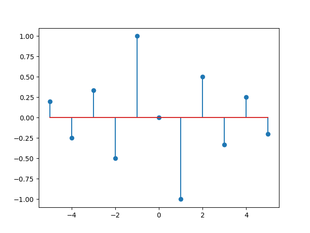

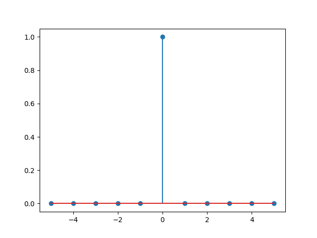

The inputs and outputs of the filtering


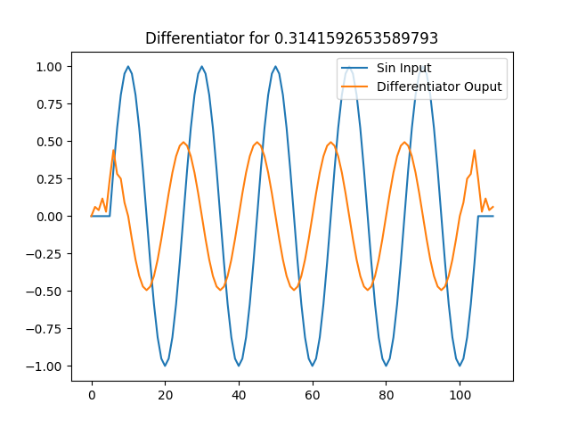

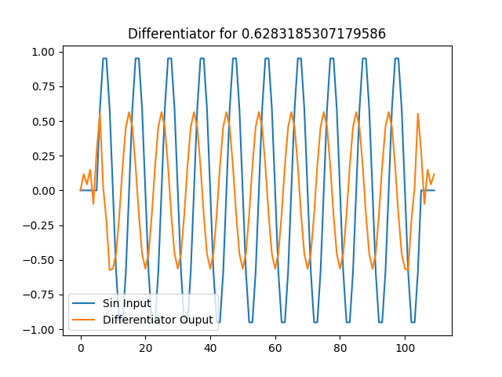

The code used to differentiate

```python
from numpy import linspace, pi, sin, cos, convolve
import matplotlib.pyplot as plt

class Differentiator:
    def __init__(self, T, filter_len = 11) -> None:
        self.filter_len = filter_len
        self.L = int((self.filter_len - 1) / 2)
        self.T = T
        self.inputs = [0] * filter_len
        self.indeces = list(range(-self.L, self.L + 1))
        self.deriv_filter = []
        self.delay_filter = []
        self.deriv = []
        self.make_filter()
        assert len(self.deriv_filter) == self.filter_len, f'Expected: {self.filter_len}, Actual {len(self.deriv_filter)}'

    def make_filter(self):
        for n in self.indeces:
            if n == 0:
                self.deriv_filter.append(0)
            else:
                self.deriv_filter.append(((-1)**n)/(self.T * n))
        self.delay_filter = [0] * self.filter_len
        self.delay_filter[self.L] = 1
    
    def plot_filter(self):
        plt.figure()
        plt.stem(self.indeces, self.deriv_filter)
        plt.savefig(f"deriv_filter.png", format='png')
        plt.figure()
        plt.stem(self.indeces, self.delay_filter)
        plt.savefig(f"delayed_filter.png", format='png')

    def get_result(self):
        return self.deriv, self.delayed

    def differentiate(self, signal):
        self.deriv = convolve(signal, self.deriv_filter)
        self.delayed = convolve(signal, self.delay_filter)

if __name__ == '__main__':
    T = 1
    diff = Differentiator(T, filter_len=11)
    diff.plot_filter()
    for w0 in [pi/10, pi/5, pi/20]:
        num_points = 100
        spacing = range(0, num_points)
        A = 1
        signal = [A * sin(w0*t) for t in spacing]

        diff.differentiate(signal)
        deriv, delay = diff.get_result()

        plt.figure()
        plt.title(f"Differentiator for {w0}")
        plt.plot(delay)
        plt.plot(deriv)
        plt.legend(["Sin Input", "Differentiator Ouput"])
        plt.savefig(f"diff_{w0}.png", format='png')

        min_index = list(delay).index(min(delay))
        print(f"Value of deriv at minimum delay {deriv[min_index]}")

        min_index = list(deriv).index(min(deriv))
        print(f"Value of delay at minimum deriv {delay[min_index]}")
```

## Problem 3

Here is the output of the Farrow interpolators:

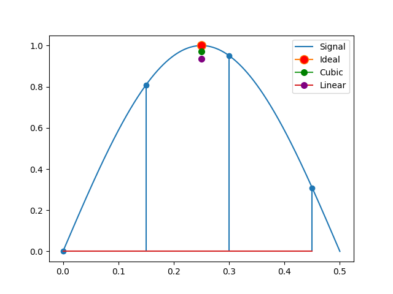

And the associated code

```python
from numpy import sin, pi, linspace
import matplotlib.pyplot as plt

class Interpolator:
    def __init__(self) -> None:
        self.samples = [0] * 4
        self.interpolated_val = 0
        self.color = 'blue'
        self.name = "None"

    def interpolate(self, mu=None):
        """If no mu is given, mu coefficients will not be updated"""
        assert False, "Didn't Overwrite function"

    def new_sample(self, sample):
        #Shift the samples down and insert the new sample
        for index in reversed(range(len(self.samples))):
            if index == 0:
                self.samples[0] = sample
            else:
                self.samples[index] = self.samples[index - 1]

    def calc_mu_coefficients(self, mu):
        assert False, "Didn't Overwrite function"

    def get_result(self):
        return self.interpolated_val

class CubicInterpolator(Interpolator):
    def __init__(self) -> None:
        super().__init__()
        self.coefficients = [0] * 4
        self.exponents = [3,2,1,0]
        self.b_coef = [
            [1/6,  0,   -1/6, 0],
            [-1/2, 1/2, 1,    0],
            [1/2,  -1,  -1/2, 1],
            [-1/6, 1/2, -1/3, 0]
        ]
        self.color = 'green'
        self.name = "Cubic"

    def interpolate(self, mu=None):
        if mu:
            self.calc_mu_coefficients(mu)
        self.interpolated_val = 0
        for index in range(len(self.samples)):
            self.interpolated_val += self.samples[index] * self.coefficients[index]
        return self.interpolated_val

    def calc_mu_coefficients(self, mu):
        for i in range(len(self.coefficients)):
            self.coefficients[i] = 0
            for l in range(len(self.b_coef)):
                self.coefficients[i] += (mu**self.exponents[l]) * self.b_coef[i][l]

class LinearInterpolator(Interpolator):
    def __init__(self) -> None:
        super().__init__()
        self.coefficients = [0]*2
        self.color = 'purple'
        self.name = "Linear"

    def calc_mu_coefficients(self, mu):
        self.coefficients[0] = mu
        self.coefficients[1] = 1 - mu

    def interpolate(self, mu=None):
        if mu:
            self.calc_mu_coefficients(mu)
        self.interpolated_val = 0
        for index in range(len(self.coefficients)):
            self.interpolated_val += self.samples[index + 1] * self.coefficients[index]
        return self.interpolated_val


if __name__ == '__main__':
    F0 = 1
    T = 0.15 / F0
    spacing = linspace(0,0.5,1000)
    signal = [sin(2*pi*F0*t) for t in spacing]

    perfect_sample_time = spacing[signal.index(max(signal))]
    mu = perfect_sample_time - T

    sample_times = [3*T, 2*T, T, 0]
    interpolators = [CubicInterpolator(), LinearInterpolator()]
    for interpolator in interpolators:
        interpolator.calc_mu_coefficients(mu)

        for t in sample_times:
            interpolator.new_sample(sin(2*pi*t))
        interpolator.interpolate()

    plt.figure()
    plt.plot(spacing, signal)
    plt.stem(list(reversed(sample_times)), interpolators[0].samples)
    plt.plot(perfect_sample_time, 1, marker="o", markersize=10, markerfacecolor="red")
    for interp in interpolators:
        plt.plot(T + mu, interp.get_result(), marker="o", markersize=7, markerfacecolor=interp.color, markeredgecolor=interp.color)
    plt.legend(["Signal", "Ideal"] + [interp.name for interp in interpolators])
    plt.savefig("interpolators.png", format='png')
```

## Problem 4

### For the Cubic Interpolator with 4 samples/symbol

The filter outputs do converge over time

    Do the rx and tx bits match? Yes

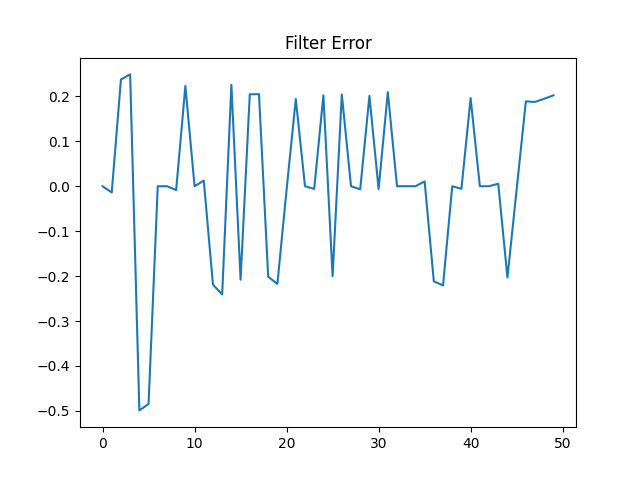

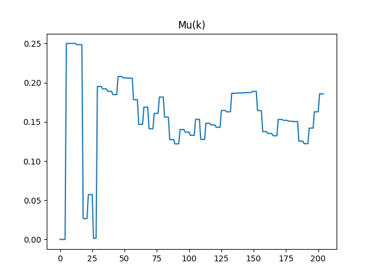

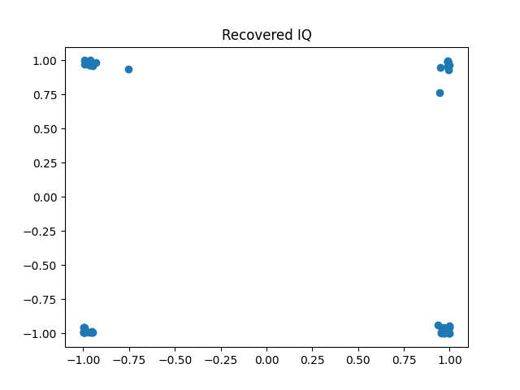

### For the Linear Interpolator with 16 samples/symbol

The filter outputs do converge over time

    Do the rx and tx bits match? Yes

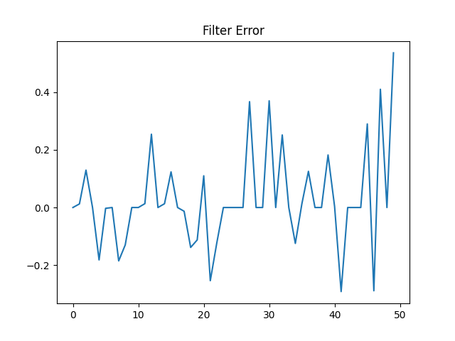

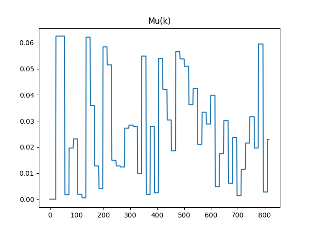

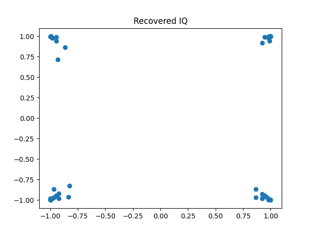

symbol_timing.py
```python
import matplotlib.pyplot as plt
from differentiate import Differentiator
from interpolator import *
from ted import TED
from pulses import *
from tx_rx import *

K = 1
N = 160
Lp = 160
num_bits = 100
Ts = 1
alpha = 1
pulse = srrc1(alpha, N, Lp, Ts)

########################
# Transmit
########################

tx = TX(num_bits, pulse, N)
tx.plot_signal()
I_sent, Q_sent = tx.get_signal()
sent_bits = tx.bits


########################
# Receive
########################

diff_filter_len = 11
diff_T = 1

rx = RX(I_sent, Q_sent, 10, Lp, pulse, diff_filter_len, diff_T)
rx.plot_sampled_signal() # This has been through the matched filter and derivitive filter

rx_I, rx_Q = rx.get_sampled_signal()
rx_Ip, rx_Qp = rx.get_sampled_deriv()

assert len(rx_I) == len(rx_Q) == len(rx_Ip) == len(rx_Qp), "RX Signal and Derivitive are not the same length"

plt.figure()
plt.scatter(rx_I, rx_Q)
plt.title("Received IQ")
plt.savefig("rx_IQ.png", format='png')

########################
# Interpolation
########################

num_samples = 16
ted = TED(num_samples=num_samples)
I_int = LinearInterpolator(num_samples=num_samples)
Q_int = LinearInterpolator(num_samples=num_samples)
Ip_int = LinearInterpolator(num_samples=num_samples)
Qp_int = LinearInterpolator(num_samples=num_samples)

I_results = [0]
Q_results = [0]
Ip_results = [0]
Qp_results = [0]
mus = []
for index in range(len(rx_I)):
    # New samples
    I_int.new_sample(rx_I[index])
    Q_int.new_sample(rx_Q[index])
    Ip_int.new_sample(rx_Ip[index])
    Qp_int.new_sample(rx_Qp[index])

    # Give the ted the last signal and derivitie samples
    mu = ted.timing_error(I_results[-1], Q_results[-1], Ip_results[-1], Qp_results[-1])
    mus.append(mu)
    if ted.strobe:
        I_int.interpolate(mu); Q_int.interpolate(mu); Ip_int.interpolate(mu); Qp_int.interpolate(mu)
        # I_int.plot("I_int")
        I_results.append(I_int.get_result())
        Q_results.append(Q_int.get_result())
        Ip_results.append(Ip_int.get_result())
        Qp_results.append(Qp_int.get_result())
I_results.pop(0)
Q_results.pop(0)
Ip_results.pop(0)
Qp_results.pop(0)

recieved_bits = []
for I, Q in zip(I_results, Q_results):
    a0, a1 = rx.slice_QPSK(I, Q)
    recieved_bits.append(a0)
    recieved_bits.append(a1)
print(f"Do the rx and tx bits match? {'Yes' if recieved_bits == sent_bits else 'No'} ")

plt.figure()
plt.plot(mus)
plt.title("Mu(k)")
plt.savefig(f"mus_{I_int.name}.png", format='png')

plt.figure()
plt.plot(ted.es)
plt.title("Filter Error")
plt.savefig(f"e_{I_int.name}.png", format='png')

plt.figure()
plt.scatter(I_results, Q_results)
plt.title("Recovered IQ")
plt.savefig(f"recovered_IQ_{I_int.name}.png", format='png')

```

ted.py
```python
from numpy import sqrt
from interpolator import *

class TED:
    def __init__(self, K0=-1, KP=0.23, num_samples=4) -> None:
        self.strobe = 0
        self.mu = 0
        self.K1 = 0
        self.K2 = 0
        self.K0 = K0
        self.KP = KP
        self.BnT = 0.01
        self.Z = 1/sqrt(2)
        self.compute_K1_K2(self.BnT, self.Z, self.K0, self.KP)
        self.e = 0
        self.es = []
        self.loop_delay = 0
        self.aida = 0
        self.dec_delay = 1.5
        self.strobe = False
        self.num_samples = num_samples

    def compute_K1_K2(self, BnT, Z, K0, Kp):
        K0_Kp_K1 = (4 * Z * BnT / (Z + 1 / (4 * Z)))  / (1 + 2 * Z * BnT / (Z + 1 / (4 * Z)) + (BnT / (Z + 1 / (4 * Z)))**2)
        K0_Kp_K2 = (4 * (BnT / (Z + 1 / (4 * Z)))**2) / (1 + 2 * Z * BnT / (Z + 1 / (4 * Z)) + (BnT / (Z + 1 / (4 * Z)))**2)

        self.K1 = K0_Kp_K1 / (K0 * Kp)
        self.K2 = K0_Kp_K2 / (K0 * Kp)

    def loop_filter(self):
        self.v = (self.e * self.K1) + self.loop_delay
        self.loop_delay += self.e * self.K2

    def dec_mod_count(self):
        self.aida = self.dec_delay
        self.dec_delay -= self.v + (1/self.num_samples)
        if self.dec_delay <= 0:
            self.strobe = True
            self.dec_delay += 1
        else:
            self.strobe = False

    def compute_mu(self):
        if self.strobe:
            self.mu = (self.aida / (1 - self.aida + self.aida))

    def timing_error(self, I, Q, Ip, Qp):
        self.loop_filter()
        self.dec_mod_count()
        self.compute_mu()
        if self.strobe:
            self.e = (I * Qp) - (Q * Ip)
            self.es.append(self.e)
        else:
            self.e = 0

        return self.mu

```

tx_rx.py
```python
import numpy as np
from random import random
import matplotlib.pyplot as plt
from differentiate import Differentiator

class TX:
    def __init__(self, num_bits, pulse, upsample_num) -> None:
        self.bits = [int(random() > 0.5) for _ in range(num_bits)]
        self.I = []
        self.Q = []
        self.I_shaped = []
        self.Q_shaped = []
        self.upsample_num = upsample_num
        self.pulse = pulse

        self.bits_to_IQ()
        self.I_up = self.upsample(self.I)
        self.Q_up = self.upsample(self.Q)
        self.shape_pulses()

    def bits_to_IQ(self):
        self.I = []
        self.Q = []
        for index in range(int(len(self.bits)/2)):
            self.I.append(-1 if self.bits[index * 2    ] == 0 else 1)
            self.Q.append(-1 if self.bits[index * 2 + 1] == 0 else 1)

    def upsample(self, signal):
        sig = np.zeros((len(signal)*self.upsample_num,1))
        sig[range(0,len(signal)*self.upsample_num,self.upsample_num)] = np.array(signal).reshape(len(signal),1)
        return sig[:,0]
    
    def shape_pulses(self):
        self.I_shaped = np.convolve(self.I_up, self.pulse)
        self.Q_shaped = np.convolve(self.Q_up, self.pulse)

    def plot_signal(self, file_name="tx_signal.png", format='png'):
        plt.figure()
        plt.subplot(2,1,1)
        plt.title("Transmitted Signal")
        plt.ylabel("I")
        plt.plot(self.I_shaped)
        plt.subplot(2,1,2)
        plt.ylabel("Q")
        plt.plot(self.Q_shaped)
        plt.savefig(file_name, format=format)

    def get_signal(self):
        return self.I_shaped, self.Q_shaped
        

class RX:
    def __init__(self, I, Q, sample_time, Lp, pulse, diff_filter_len, diff_T) -> None:
        self.differentiator = Differentiator(diff_T, diff_filter_len)
        self.max_constellation_val = 1
        
        # Matched Filter
        self.I_matched = self.matched_filter(I, pulse)
        self.Q_matched = self.matched_filter(Q, pulse)

        # Differentiating and Delaying
        self.differentiator.differentiate(self.I_matched)
        self.I_deriv, self.I_delay = self.differentiator.get_result()
        self.differentiator.differentiate(self.Q_matched)
        self.Q_deriv, self.Q_delay = self.differentiator.get_result()
        
        # Sampling and Normalizing
        self.I_delay_sample = self.sample_signal(self.I_delay, sample_time, Lp)
        self.Q_delay_sample = self.sample_signal(self.Q_delay, sample_time, Lp)
        self.I_delay_normal = self.normalize_amplitude(self.I_delay_sample, self.max_constellation_val)
        self.Q_delay_normal = self.normalize_amplitude(self.Q_delay_sample, self.max_constellation_val)

        self.I_deriv_sample = self.sample_signal(self.I_deriv, sample_time, Lp)
        self.Q_deriv_sample = self.sample_signal(self.Q_deriv, sample_time, Lp)
        self.I_deriv_normal = self.normalize_amplitude(self.I_deriv_sample, self.max_constellation_val)
        self.Q_deriv_normal = self.normalize_amplitude(self.Q_deriv_sample, self.max_constellation_val)

    def get_sampled_signal(self):
        return self.I_delay_normal, self.Q_delay_normal

    def get_sampled_deriv(self):
        return self.I_deriv_normal, self.Q_deriv_normal
    
    def plot_sampled_signal(self, file_name='rx_sampled.png', format='png'):
        plt.figure()
        plt.subplot(2,1,1)
        plt.title("Received Samples")
        plt.stem(self.I_delay_normal)
        plt.ylabel("I")
        plt.subplot(2,1,2)
        plt.ylabel("Q")
        plt.stem(self.Q_delay_normal)
        plt.savefig(file_name, format=format)

    def sample_signal(self, sig, sample_time, Lp=0):
        sampled = []
        # for idx in range(Lp,len(sig)-Lp,sample_time):
        for idx in range(0,len(sig) - Lp, sample_time):
            sampled.append(sig[idx])
        return sampled

    def normalize_amplitude(self, signal, max_constellation_val):
        max_sig = max(max(signal),abs(min(signal)))
        return [i * max_constellation_val / max_sig for i in signal]

    def slice_QPSK(self, x, y):
        """Slices a single QPSK point"""
        a0 = 0 if x < 0 else 1
        a1 = 0 if y < 0 else 1
        return [a0, a1]

    def matched_filter(self, signal, pulse):
        pulse_reversed = list(reversed(pulse))
        return np.convolve(signal, pulse_reversed)
```