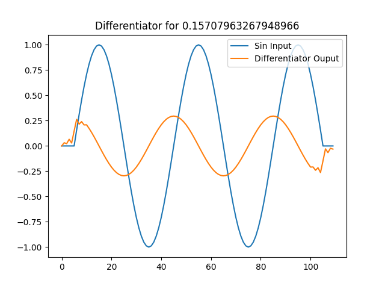

Calvin Passmore

ECE 5660

# Homework 7

## Problem 2

Below are some important values from the filters.
As shown they are close to zero meaning the filters are working.

    Value of deriv at minimum delay -1.7388596223622423e-16
    Value of delay at minimum deriv 3.6739403974420594e-16
    Value of deriv at minimum delay 0.026113647670526596
    Value of delay at minimum deriv -0.5877852522924712
    Value of deriv at minimum delay -1.6653345369377348e-16
    Value of delay at minimum deriv 3.6739403974420594e-16

The two filters:


The inputs and outputs of the filtering




The code used to differentiate

```python
from numpy import linspace, pi, sin, cos, convolve
import matplotlib.pyplot as plt

class Differentiator:
    def __init__(self, T, filter_len = 11) -> None:
        self.filter_len = filter_len
        self.L = int((self.filter_len - 1) / 2)
        self.T = T
        self.inputs = [0] * filter_len
        self.indeces = list(range(-self.L, self.L + 1))
        self.deriv_filter = []
        self.delay_filter = []
        self.deriv = []
        self.make_filter()
        assert len(self.deriv_filter) == self.filter_len, f'Expected: {self.filter_len}, Actual {len(self.deriv_filter)}'

    def make_filter(self):
        for n in self.indeces:
            if n == 0:
                self.deriv_filter.append(0)
            else:
                self.deriv_filter.append(((-1)**n)/(self.T * n))
        self.delay_filter = [0] * self.filter_len
        self.delay_filter[self.L] = 1
    
    def plot_filter(self):
        plt.figure()
        plt.stem(self.indeces, self.deriv_filter)
        plt.savefig(f"deriv_filter.png", format='png')
        plt.figure()
        plt.stem(self.indeces, self.delay_filter)
        plt.savefig(f"delayed_filter.png", format='png')

    def get_result(self):
        return self.deriv, self.delayed

    def differentiate(self, signal):
        self.deriv = convolve(signal, self.deriv_filter)
        self.delayed = convolve(signal, self.delay_filter)

if __name__ == '__main__':
    T = 1
    diff = Differentiator(T, filter_len=11)
    diff.plot_filter()
    for w0 in [pi/10, pi/5, pi/20]:
        num_points = 100
        spacing = range(0, num_points)
        A = 1
        signal = [A * sin(w0*t) for t in spacing]

        diff.differentiate(signal)
        deriv, delay = diff.get_result()

        plt.figure()
        plt.title(f"Differentiator for {w0}")
        plt.plot(delay)
        plt.plot(deriv)
        plt.legend(["Sin Input", "Differentiator Ouput"])
        plt.savefig(f"diff_{w0}.png", format='png')

        min_index = list(delay).index(min(delay))
        print(f"Value of deriv at minimum delay {deriv[min_index]}")

        min_index = list(deriv).index(min(deriv))
        print(f"Value of delay at minimum deriv {delay[min_index]}")
```

## Problem 3

Here is the output of the Farrow interpolators:


And the associated code

```python
from numpy import sin, pi, linspace
import matplotlib.pyplot as plt

class Interpolator:
    def __init__(self) -> None:
        self.samples = [0] * 4
        self.interpolated_val = 0
        self.color = 'blue'
        self.name = "None"

    def interpolate(self, mu=None):
        """If no mu is given, mu coefficients will not be updated"""
        assert False, "Didn't Overwrite function"

    def new_sample(self, sample):
        #Shift the samples down and insert the new sample
        for index in reversed(range(len(self.samples))):
            if index == 0:
                self.samples[0] = sample
            else:
                self.samples[index] = self.samples[index - 1]

    def calc_mu_coefficients(self, mu):
        assert False, "Didn't Overwrite function"

    def get_result(self):
        return self.interpolated_val

class CubicInterpolator(Interpolator):
    def __init__(self) -> None:
        super().__init__()
        self.coefficients = [0] * 4
        self.exponents = [3,2,1,0]
        self.b_coef = [
            [1/6,  0,   -1/6, 0],
            [-1/2, 1/2, 1,    0],
            [1/2,  -1,  -1/2, 1],
            [-1/6, 1/2, -1/3, 0]
        ]
        self.color = 'green'
        self.name = "Cubic"

    def interpolate(self, mu=None):
        if mu:
            self.calc_mu_coefficients(mu)
        self.interpolated_val = 0
        for index in range(len(self.samples)):
            self.interpolated_val += self.samples[index] * self.coefficients[index]
        return self.interpolated_val

    def calc_mu_coefficients(self, mu):
        for i in range(len(self.coefficients)):
            self.coefficients[i] = 0
            for l in range(len(self.b_coef)):
                self.coefficients[i] += (mu**self.exponents[l]) * self.b_coef[i][l]

class LinearInterpolator(Interpolator):
    def __init__(self) -> None:
        super().__init__()
        self.coefficients = [0]*2
        self.color = 'purple'
        self.name = "Linear"

    def calc_mu_coefficients(self, mu):
        self.coefficients[0] = mu
        self.coefficients[1] = 1 - mu

    def interpolate(self, mu=None):
        if mu:
            self.calc_mu_coefficients(mu)
        self.interpolated_val = 0
        for index in range(len(self.coefficients)):
            self.interpolated_val += self.samples[index + 1] * self.coefficients[index]
        return self.interpolated_val


if __name__ == '__main__':
    F0 = 1
    T = 0.15 / F0
    spacing = linspace(0,0.5,1000)
    signal = [sin(2*pi*F0*t) for t in spacing]

    perfect_sample_time = spacing[signal.index(max(signal))]
    mu = perfect_sample_time - T

    sample_times = [3*T, 2*T, T, 0]
    interpolators = [CubicInterpolator(), LinearInterpolator()]
    for interpolator in interpolators:
        interpolator.calc_mu_coefficients(mu)

        for t in sample_times:
            interpolator.new_sample(sin(2*pi*t))
        interpolator.interpolate()

    plt.figure()
    plt.plot(spacing, signal)
    plt.stem(list(reversed(sample_times)), interpolators[0].samples)
    plt.plot(perfect_sample_time, 1, marker="o", markersize=10, markerfacecolor="red")
    for interp in interpolators:
        plt.plot(T + mu, interp.get_result(), marker="o", markersize=7, markerfacecolor=interp.color, markeredgecolor=interp.color)
    plt.legend(["Signal", "Ideal"] + [interp.name for interp in interpolators])
    plt.savefig("interpolators.png", format='png')
```