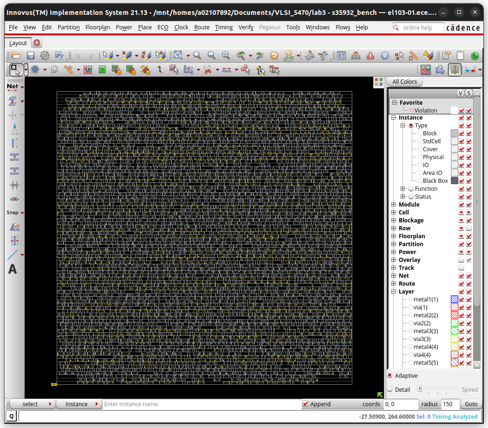

Calvin Passmore

ECE 6470

#Lab 3

## Part 1

Total CPU time: 1.28 sec

Total Memory Usage: 1652.472656 Mbytes

Total net length = 4.367e+04 (1.901e+04 2.466e+04)

|     Setup mode     |   all   | reg2reg | default |
|--------------------|---------|---------|---------|
|           WNS (ns):| -6.091  | -0.066  | -6.091  |

## Part 2

Total CPU time: 1.26 sec

Total Memory Usage: 1652.316406 Mbytes

Total net length = 4.367e+04 (1.901e+04 2.466e+04)

|     Setup mode     |   all   | reg2reg | default |
|--------------------|---------|---------|---------|
|           WNS (ns):| -6.091  | -0.066  | -6.091  |

## Part 3

Total CPU time: 1.29 sec

Total Memory Usage: 1652.496094 Mbytes

Total net length = 4.367e+04 (1.901e+04 2.466e+04)

|     Setup mode     |   all   | reg2reg | default |
|--------------------|---------|---------|---------|
|           WNS (ns):| -6.091  | -0.066  | -6.091  |

