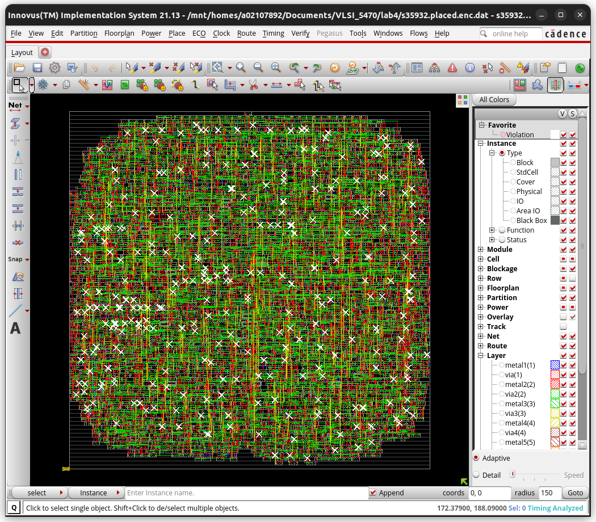

Calvin Passmore

ECE 6470

# Lab 4

## 1 
Total wire-length and via of global route results.

I found two heading with the name "Complete Global Routing", here is the data from the first:

    Total wire length = 76704 um.
    Total number of vias = 29426

And the data from the second:

    Total wire length = 85795 um.
    Total number of vias = 36765

## 2 

Total wire-length and via of detailed route results.

Again, there were two "Complete Global Routing" headings, here is the data from the first for the detailed routing

    Total wire length = 76046 um.
    Total number of vias = 29426

And the second:

    Total wire length = 85843 um.
    Total number of vias = 36765

## 3 
Slack.

|     Setup mode     |   all   | reg2reg | default |
|--------------------|---------|---------|---------|
|           WNS (ns):| -0.773  |  0.190  | -0.773  |
|           TNS (ns):|-842.246 |  0.000  |-842.246 |

## 4 
Snapshot of the routed map.

