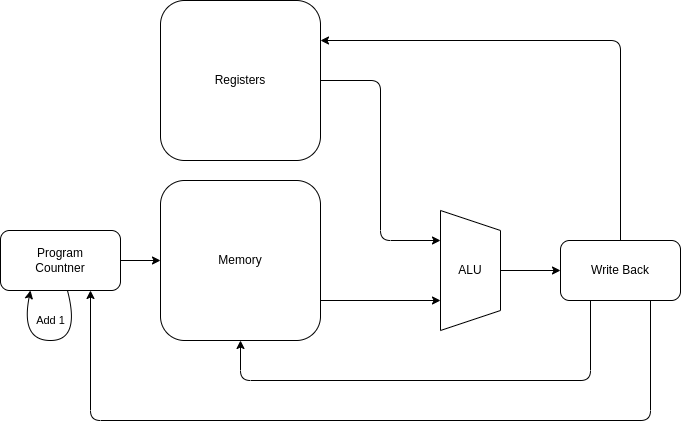

Calvin Passmore

ECE 6470

# Midterm Progress Report

My project is a simplified MIPS processor, a Microprocessor without Interlocked Pipelined Stages. Each stage will happen within one clock cycle, and therefore the clock will need to run relatively slow. The following instructions are implemented:

| Name | Meaning | OpCode |
|------|---------|--------|
| NOOP | Do Nothing | 0000 |
| Load | Load from memory into register | 0001 |
| Load Number | Load a scalar into the register | 0010 |
| Store | Store from the register into memory | 0011 |
| Add | Add two registers | 0100 |
| Subtract | Subtract two registers into a single register | 0101 |
| XOR | Xor two registeres into a single register | 0110 |
| And | And individual bits in two register into one register | 0111 |
| Jump | Jump to static address | 1000 |
| Jump in non 0 | Jump to static address if the given register is not 0 | 1001 |
| Push | Push the register value onto the stack | 1010 |
| Pop | Pop the top value off the stack into a register | 1011 |

## Block Diagram



## Golden Model

The golden model was implemented in C and include two files: mips.c and defs.h.
The results of the golden model simulation is stored in logs, and the most recent log is shown after the source code.
The results of the code is verified for the golden model from hand calculations.
The very last part of the log file is the output assembly to be able to input it into the mips.v.
These files are included in the Appendix

## Simulation Reults

The verilog and simulation files give the following results:

```
**************************************************************************************
** TEST                          STATUS  SIM TIME (ns)  REAL TIME (s)  RATIO (ns/s) **
**************************************************************************************
** mips_testbench.test_run        PASS     1000000.00           0.02   46120648.37  **
**************************************************************************************
** TESTS=1 PASS=1 FAIL=0 SKIP=0            1000000.00           0.03   32036663.08  **
**************************************************************************************
```

These results check initialization of the memory and correct compilation of the source verilog file. The verilog source file and cocotb testbench are included in the appendix

# Appendix

## mips.c
```c
#include <stdint.h>
#include <stdbool.h>
#include <stdlib.h>
#include <stdio.h>
#include "defs.h"

instruction_t fib_assembly[ASSEMBLY_LEN] = {
    {.opcode = NOOP, .dest = NULL_REG, .src1 = NULL_REG, .src2 = NULL_REG },
    {.opcode = LOAD, .dest = REG_0,    .src1 = NULL_REG, .src2 = 0x0},      // Read from memory the Fib number to calculate (+1)
    {.opcode = LDNM, .dest = REG_A,    .src1 = NULL_REG, .src2 = 0x1},      // Load a 1 into a register
    {.opcode = LDNM, .dest = REG_B,    .src1 = NULL_REG, .src2 = 0x0},      // Load a 0 into a register
    {.opcode = LDNM, .dest = REG_1,    .src1 = NULL_REG, .src2 = 0x0},      // Load the first two Fibonacci numbers
    {.opcode = LDNM, .dest = REG_2,    .src1 = NULL_REG, .src2 = 0x1},
    //Loop Start
    {.opcode = SUB,  .dest = REG_0,    .src1 = REG_0,    .src2 = REG_A},    // Decrement the counter

    {.opcode = ADD,  .dest = REG_3,    .src1 = REG_1,    .src2 = REG_2},    // Add the two Fib numbers
    {.opcode = ADD,  .dest = REG_1,    .src1 = REG_2,    .src2 = REG_B},    // Shift the new Fib numbers
    {.opcode = ADD,  .dest = REG_2,    .src1 = REG_3,    .src2 = REG_B},
    
    {.opcode = JMP0, .dest = 0x6,      .src1 = NULL_REG, .src2 = REG_0},    // If the Reg 0 is not 0, jump to the beginning of the loop
    //Loop End
    {.opcode = STR,  .dest = 0x1,      .src1 = NULL_REG, .src2 = REG_3},    // Load the Fib value into the return register
    //FIbonacci end

    //Use other opcodes
    {.opcode = LOAD, .dest = REG_0,    .src1 = NULL_REG, .src2 = 0x2},      // Load the first number
    {.opcode = LOAD, .dest = REG_1,    .src1 = NULL_REG, .src2 = 0x3},      // Load the second number
    {.opcode = AND,  .dest = REG_2,    .src1 = REG_1,    .src2 = REG_0},    // And the numbers
    {.opcode = PUSH, .dest = NULL_REG, .src1 = NULL_REG, .src2 = REG_2},    // Put the And on the stack
    {.opcode = XOR,  .dest = REG_2,    .src1 = REG_1,    .src2 = REG_0},    // XOR The two numbers
    {.opcode = PUSH, .dest = NULL_REG, .src1 = NULL_REG, .src2 = REG_2},    // Pusht the XOR value
    {.opcode = POP,  .dest = REG_0,    .src1 = NULL_REG, .src2 = NULL_REG}, // Get the xor value from the stack
    {.opcode = STR,  .dest = 0x4,      .src1 = NULL_REG, .src2 = REG_0},    // Put the XOR in the memory
    {.opcode = POP,  .dest = REG_0,    .src1 = NULL_REG, .src2 = NULL_REG}, // Get the AND value
    {.opcode = STR,  .dest = 0x5,      .src1 = NULL_REG, .src2 = REG_0},    // Store the and value in memory
    {.opcode = JMP,  .dest = 24,       .src1 = NULL_REG, .src2 = NULL_REG}, // JUMP Across the next store
    {.opcode = STR,  .dest = 0x6,      .src1 = NULL_REG, .src2 = REG_3},    // This should be skipped, if it isn't memory 6 will be the fib number
    
    {.opcode = NOOP, .dest = NULL_REG, .src1 = NULL_REG, .src2 = NULL_REG },
    {.opcode = NOOP, .dest = NULL_REG, .src1 = NULL_REG, .src2 = NULL_REG },
    {.opcode = NOOP, .dest = NULL_REG, .src1 = NULL_REG, .src2 = NULL_REG },
    {.opcode = NOOP, .dest = NULL_REG, .src1 = NULL_REG, .src2 = NULL_REG },
    {.opcode = NOOP, .dest = NULL_REG, .src1 = NULL_REG, .src2 = NULL_REG },
    {.opcode = NOOP, .dest = NULL_REG, .src1 = NULL_REG, .src2 = NULL_REG },
    {.opcode = NOOP, .dest = NULL_REG, .src1 = NULL_REG, .src2 = NULL_REG },
    {.opcode = JMP,  .dest = 31,       .src1 = NULL_REG, .src2 = NULL_REG },//Dead Loop
};
uint32_t fib_memory[MEM_LEN] = {
    0xF,    // Fib number to calculate (+1)
    0x0,    // Fib answer
    0x3,    // Checking other opcodes
    0xF,
};

#define print_info print_register_info(curr_addr, curr_instr, return_reg, ALU_1, ALU_2, ALU_OUT, registers)
void print_register_info(uint32_t curr_addr, instruction_t curr_instr, uint32_t return_reg, uint32_t ALU_1, uint32_t ALU_2, uint32_t ALU_OUT, uint32_t registers[]) {
    printf("*******************************\n");
    printf("Current Address: 0x%X\n", curr_addr);
    printf("Current Instruction:\n");
    printf("\tOPCODE: 0x%X\n", curr_instr.opcode);
    printf("\tDest:   0x%X\n", curr_instr.dest);
    printf("\tSRC1:   0x%X\n", curr_instr.src1);
    printf("\tSRC2:   0x%X\n", curr_instr.src2);
    printf("ALU_1: 0x%X\n", ALU_1);
    printf("ALU_2: 0x%X\n", ALU_2);
    printf("ALU_OUT: 0x%X\n", ALU_OUT);
    printf("Return Reg: 0x%X\n", return_reg);
    for (int i = 0; i < NUM_REG; i++) {
        printf("Reg %2d: 0x%X\n", i, registers[i]);
    }
}

void printbin(uint32_t num, int bits) {
    for (int i = bits - 1; i >= 0; i--) {
        printf("%d", (num >> i) & 1);
    }
}

void print_assembly(instruction_t assembly[]) {
    for (int i = 0; i < ASSEMBLY_LEN; i++) {
        printbin(assembly[i].opcode, 8);
        printbin(assembly[i].dest, 8);
        printbin(assembly[i].src1, 8);
        printbin(assembly[i].src2, 8);
        printf("\n");
    }
}

void main() {
    uint32_t *memory = fib_memory;
    instruction_t *assembly = fib_assembly;
    uint32_t stack[STACK_LEN] = {};
    uint32_t stack_index = 0;
    uint32_t registers[NUM_REG] = {};
    int curr_addr = 0;
    instruction_t curr_instr;
    uint32_t return_reg = 0;
    uint32_t ALU_1 = 0;
    uint32_t ALU_2 = 0;
    uint32_t ALU_OUT = 0;

    while (true) {
        // Instruction Fetch
        curr_instr = assembly[curr_addr++];

        // Info Prep
        switch(curr_instr.opcode) {
            case NOOP:
            case LOAD:
            case LDNM:
            case STR:
            case JMP:
            case JMP0:
            case PUSH:
            case POP:
                ALU_1 = 0;
                ALU_2 = 0;
                break;

            case ADD:
            case SUB:
            case XOR:
            case AND:
                ALU_1 = registers[curr_instr.src1];
                ALU_2 = registers[curr_instr.src2];
                break;

            default:
                printf("Error! INVALID OPCODE info prep\n");
                exit(2);
                break;
        }

        //ALU
        switch(curr_instr.opcode) {
            case NOOP:
            case LOAD:
            case LDNM:
            case STR:
            case JMP:
            case JMP0:
            case PUSH:
            case POP:
                ALU_OUT = 0;
                break;

            case ADD:
                ALU_OUT = ALU_1 + ALU_2;
                break;

            case SUB:
                ALU_OUT = ALU_1 - ALU_2;
                break;

            case XOR:
                ALU_OUT = ALU_1 ^ ALU_2;
                break;

            case AND:
                ALU_OUT = ALU_1 & ALU_2;
                break;

            default:
                printf("Error! INVALID OPCODE ALU\n");
                exit(2);
                break;
        }

        //Memory & Write
        switch(curr_instr.opcode) {
            case NOOP:
                break;

            case LOAD:
                registers[curr_instr.dest] = memory[curr_instr.src2];
                break;

            case LDNM:
                registers[curr_instr.dest] = curr_instr.src2;
                break;

            case STR:
                memory[curr_instr.dest] = registers[curr_instr.src2];
                break;

            case JMP:
                curr_addr = curr_instr.dest;
                break;

            case JMP0:
                if (registers[curr_instr.src2] != 0) {
                    curr_addr = curr_instr.dest;
                }
                break;

            case PUSH:
                stack[stack_index++] = registers[curr_instr.src2];
                break;

            case POP:
                registers[curr_instr.dest] = stack[--stack_index];
                break;

            case ADD:
            case SUB:
            case XOR:
            case AND:
                if (curr_instr.dest == REG_R) { //If setting the return register
                    return_reg = ALU_OUT;
                }
                else {
                    registers[curr_instr.dest] = ALU_OUT;
                }
                break;

            default:
                printf("Error! INVALID OPCODE Memory\n");
                exit(2);
                break;
        }

        print_info;

        if (curr_addr >= ASSEMBLY_LEN - 1) {
            break;
        }
    }

    printf("***********Done***********\n");
    for (int i = 0; i < MEM_LEN; i++) {
        printf("Mem[%2d] = 0x%X - %d\n", i, memory[i], memory[i]);
    }

    printf("\n\n");
    print_assembly(assembly);
}
```

## defs.h
```c
#ifndef _DEFS_H_
#define _DEFS_H_

//#########################################
// Defines
//#########################################

#define STACK_LEN 32
#define NUM_REG 12
#define MEM_LEN 32
#define ASSEMBLY_LEN 32

//#########################################
// Struct
//#########################################

typedef struct instruction_t {
    uint16_t opcode;
    uint8_t dest;
    uint8_t src1;
    uint8_t src2;
} instruction_t;

// OPCODE DESTINATION SOURCE1 SOURCE2

//#########################################
// OPCODES
//#########################################

#define NOOP 0b00000000   // NOOP
#define LOAD 0b00000001   // Load from memory 
#define LDNM 0b00000010   // Load number
#define STR  0b00000011   // Store into memory
#define ADD  0b00000100   // Add
#define SUB  0b00000101   // Subtract
#define XOR  0b00000110   // XOR
#define AND  0b00000111   // AND
#define JMP  0b00001000   // Jump
#define JMP0 0b00001001   // Jump if non 0
#define PUSH 0b00001010   // Push to stack
#define POP  0b00001011   // Pop from stack

//#########################################
// Registers
//#########################################

#define REG_0 0b00000000
#define REG_1 0b00000001
#define REG_2 0b00000010
#define REG_3 0b00000011
#define REG_4 0b00000100
#define REG_5 0b00000101
#define REG_6 0b00000110
#define REG_7 0b00000111
#define REG_8 0b00001000
#define REG_9 0b00001001
#define REG_A 0b00001010
#define REG_B 0b00001011
#define REG_R 0b00001100
#define ADDR  0b00001101
#define INSTR 0b00001110
#define STACK 0b00001111

#define NULL_REG 0b00000000

#endif // _DEFS_H_
```

```log
*******************************
Current Address: 0x1
Current Instruction:
	OPCODE: 0x0
	Dest:   0x0
	SRC1:   0x0
	SRC2:   0x0
ALU_1: 0x0
ALU_2: 0x0
ALU_OUT: 0x0
Return Reg: 0x0
Reg  0: 0x0
Reg  1: 0x0
Reg  2: 0x0
Reg  3: 0x0
Reg  4: 0x0
Reg  5: 0x0
Reg  6: 0x0
Reg  7: 0x0
Reg  8: 0x0
Reg  9: 0x0
Reg 10: 0x0
Reg 11: 0x0
*******************************
... <deleted some logs for length purposes> ...
*******************************
Current Address: 0x1D
Current Instruction:
	OPCODE: 0x0
	Dest:   0x0
	SRC1:   0x0
	SRC2:   0x0
ALU_1: 0x0
ALU_2: 0x0
ALU_OUT: 0x0
Return Reg: 0x0
Reg  0: 0x3
Reg  1: 0xF
Reg  2: 0xC
Reg  3: 0x3DB
Reg  4: 0x0
Reg  5: 0x0
Reg  6: 0x0
Reg  7: 0x0
Reg  8: 0x0
Reg  9: 0x0
Reg 10: 0x1
Reg 11: 0x0
*******************************
Current Address: 0x1E
Current Instruction:
	OPCODE: 0x0
	Dest:   0x0
	SRC1:   0x0
	SRC2:   0x0
ALU_1: 0x0
ALU_2: 0x0
ALU_OUT: 0x0
Return Reg: 0x0
Reg  0: 0x3
Reg  1: 0xF
Reg  2: 0xC
Reg  3: 0x3DB
Reg  4: 0x0
Reg  5: 0x0
Reg  6: 0x0
Reg  7: 0x0
Reg  8: 0x0
Reg  9: 0x0
Reg 10: 0x1
Reg 11: 0x0
*******************************
Current Address: 0x1F
Current Instruction:
	OPCODE: 0x0
	Dest:   0x0
	SRC1:   0x0
	SRC2:   0x0
ALU_1: 0x0
ALU_2: 0x0
ALU_OUT: 0x0
Return Reg: 0x0
Reg  0: 0x3
Reg  1: 0xF
Reg  2: 0xC
Reg  3: 0x3DB
Reg  4: 0x0
Reg  5: 0x0
Reg  6: 0x0
Reg  7: 0x0
Reg  8: 0x0
Reg  9: 0x0
Reg 10: 0x1
Reg 11: 0x0
***********Done***********
Mem[ 0] = 0xF - 15
Mem[ 1] = 0x3DB - 987
Mem[ 2] = 0x3 - 3
Mem[ 3] = 0xF - 15
Mem[ 4] = 0xC - 12
Mem[ 5] = 0x3 - 3
Mem[ 6] = 0x0 - 0
Mem[ 7] = 0x0 - 0
Mem[ 8] = 0x0 - 0
Mem[ 9] = 0x0 - 0
Mem[10] = 0x0 - 0
Mem[11] = 0x0 - 0
Mem[12] = 0x0 - 0
Mem[13] = 0x0 - 0
Mem[14] = 0x0 - 0
Mem[15] = 0x0 - 0
Mem[16] = 0x0 - 0
Mem[17] = 0x0 - 0
Mem[18] = 0x0 - 0
Mem[19] = 0x0 - 0
Mem[20] = 0x0 - 0
Mem[21] = 0x0 - 0
Mem[22] = 0x0 - 0
Mem[23] = 0x0 - 0
Mem[24] = 0x0 - 0
Mem[25] = 0x0 - 0
Mem[26] = 0x0 - 0
Mem[27] = 0x0 - 0
Mem[28] = 0x0 - 0
Mem[29] = 0x0 - 0
Mem[30] = 0x0 - 0
Mem[31] = 0x0 - 0


00000000000000000000000000000000
00000001000000000000000000000000
00000010000010100000000000000001
00000010000010110000000000000000
00000010000000010000000000000000
00000010000000100000000000000001
00000101000000000000000000001010
00000100000000110000000100000010
00000100000000010000001000001011
00000100000000100000001100001011
00001001000001100000000000000000
00000011000000010000000000000011
00000001000000000000000000000010
00000001000000010000000000000011
00000111000000100000000100000000
00001010000000000000000000000010
00000110000000100000000100000000
00001010000000000000000000000010
00001011000000000000000000000000
00000011000001000000000000000000
00001011000000000000000000000000
00000011000001010000000000000000
00001000000110000000000000000000
00000011000001100000000000000011
00000000000000000000000000000000
00000000000000000000000000000000
00000000000000000000000000000000
00000000000000000000000000000000
00000000000000000000000000000000
00000000000000000000000000000000
00000000000000000000000000000000
00001000000111110000000000000000

```

## mips.v
```v
module mips(input clk);
    reg         [31:0] curr_address;
    reg  [0:12] [31:0] registers;
    reg         [31:0] return_reg;
    assign return_reg = registers[12];
    reg         [31:0] curr_instr;
    reg         [31:0] ALU_1;
    reg         [31:0] ALU_2;
    reg         [31:0] ALU_OUT;
    reg  [0:31] [31:0] stack;
    reg         [ 4:0] stack_addr;
    reg  [0:31] [31:0] memory;
    reg  [0:31] [31:0] assembly;

    reg [7:0] opcode;
    reg [7:0] dest;
    reg [7:0] src1;
    reg [7:0] src2;
    assign {opcode, dest, src1, src2} = curr_instr;

    localparam NOOP = 8'h0;
    localparam LOAD = 8'h1;
    localparam LDNM = 8'h2;
    localparam STR  = 8'h3;
    localparam ADD  = 8'h4;
    localparam SUB  = 8'h5;
    localparam XOR  = 8'h6;
    localparam AND  = 8'h7;
    localparam JMP  = 8'h8;
    localparam JMP0 = 8'h9;
    localparam PUSH = 8'hA;
    localparam POP  = 8'hB;

    initial begin
        assembly[ 0] <= 32'b00000000000000000000000000000000;
        assembly[ 1] <= 32'b00000001000000000000000000000000;
        assembly[ 2] <= 32'b00000010000010100000000000000001;
        assembly[ 3] <= 32'b00000010000010110000000000000000;
        assembly[ 4] <= 32'b00000010000000010000000000000000;
        assembly[ 5] <= 32'b00000010000000100000000000000001;
        assembly[ 6] <= 32'b00000101000000000000000000001010;
        assembly[ 7] <= 32'b00000100000000110000000100000010;
        assembly[ 8] <= 32'b00000100000000010000001000001011;
        assembly[ 9] <= 32'b00000100000000100000001100001011;
        assembly[10] <= 32'b00001001000001100000000000000000;
        assembly[11] <= 32'b00000011000000010000000000000011;
        assembly[12] <= 32'b00000001000000000000000000000010;
        assembly[13] <= 32'b00000001000000010000000000000011;
        assembly[14] <= 32'b00000111000000100000000100000000;
        assembly[15] <= 32'b00001010000000000000000000000010;
        assembly[16] <= 32'b00000110000000100000000100000000;
        assembly[17] <= 32'b00001010000000000000000000000010;
        assembly[18] <= 32'b00001011000000000000000000000000;
        assembly[19] <= 32'b00000011000001000000000000000000;
        assembly[20] <= 32'b00001011000000000000000000000000;
        assembly[21] <= 32'b00000011000001010000000000000000;
        assembly[22] <= 32'b00001000000110000000000000000000;
        assembly[23] <= 32'b00000011000001100000000000000011;
        assembly[24] <= 32'b00000000000000000000000000000000;
        assembly[25] <= 32'b00000000000000000000000000000000;
        assembly[26] <= 32'b00000000000000000000000000000000;
        assembly[27] <= 32'b00000000000000000000000000000000;
        assembly[28] <= 32'b00000000000000000000000000000000;
        assembly[29] <= 32'b00000000000000000000000000000000;
        assembly[30] <= 32'b00000000000000000000000000000000;
        assembly[31] <= 32'b00001000000111110000000000000000;

        memory[ 0] <= 32'hF; // Fib number to calculate (+1)
        memory[ 1] <= 32'h0; // Fib answer
        memory[ 2] <= 32'h3; // Checking other opcodes with store and load
        memory[ 3] <= 32'hF;
        memory[ 4] <= 32'h0;
        memory[ 5] <= 32'h0;
        memory[ 6] <= 32'h0;
        memory[ 7] <= 32'h0;
        memory[ 8] <= 32'h0;
        memory[ 9] <= 32'h0;
        memory[10] <= 32'h0;
        memory[11] <= 32'h0;
        memory[12] <= 32'h0;
        memory[13] <= 32'h0;
        memory[14] <= 32'h0;
        memory[15] <= 32'h0;
        memory[16] <= 32'h0;
        memory[17] <= 32'h0;
        memory[18] <= 32'h0;
        memory[19] <= 32'h0;
        memory[20] <= 32'h0;
        memory[21] <= 32'h0;
        memory[22] <= 32'h0;
        memory[23] <= 32'h0;
        memory[24] <= 32'h0;
        memory[25] <= 32'h0;
        memory[26] <= 32'h0;
        memory[27] <= 32'h0;
        memory[28] <= 32'h0;
        memory[29] <= 32'h0;
        memory[30] <= 32'h0;
        memory[31] <= 32'h0;

        registers[0]  <= 32'h0;
        registers[1]  <= 32'h0;
        registers[2]  <= 32'h0;
        registers[3]  <= 32'h0;
        registers[4]  <= 32'h0;
        registers[5]  <= 32'h0;
        registers[6]  <= 32'h0;
        registers[7]  <= 32'h0;
        registers[8]  <= 32'h0;
        registers[9]  <= 32'h0;
        registers[10] <= 32'h0;
        registers[11] <= 32'h0;
        curr_address  <= 32'h0;
        stack         <= 32'h0;
        stack_addr    <= 32'h0;
    end

    always@(posedge clk) begin
        curr_instr <= assembly[curr_address];
        curr_address <= curr_address + 1;

        //ALU Prep
        case (opcode)
            8'b0:
                ALU_1 = 32'h0;
            NOOP, LOAD, LDNM, STR, JMP, JMP0, PUSH, POP: begin
                ALU_1 = 32'h0;
                ALU_2 = 32'h0;
            end

            ADD, SUB, XOR, AND: begin
                ALU_1 <= registers[src1];
                ALU_2 <= registers[src2];
            end

            default: begin end
        endcase

        //ALU
        case (curr_instr[31:24])
            NOOP, LOAD, LDNM, STR, JMP, JMP0, PUSH, POP: begin
                ALU_OUT = 32'h0;
            end

            ADD:
                ALU_OUT = ALU_1 + ALU_2;

            SUB:
                ALU_OUT = ALU_1 - ALU_2;

            XOR:
                ALU_OUT = ALU_1 ^ ALU_2;

            AND:
                ALU_OUT <= ALU_1 & ALU_2;

            default: begin end
        endcase

        //Memory and Write
        case (opcode)
            NOOP: begin end

            LOAD:
                registers[dest] <= memory[src2];

            LDNM:
                registers[dest] <= src2;

            STR:
                memory[dest] <= registers[src2];

            JMP:
                curr_address <= dest;

            JMP0: begin
                if (registers[src2] != 0)
                    curr_address <= dest;
            end

            PUSH: begin
                stack[stack_addr] <= registers[src2];
                stack_addr <= stack_addr + 1;
            end

            POP: begin
                stack_addr <= stack_addr - 1;
                registers[dest] <= stack[stack_addr];
            end

            ADD, SUB, XOR, AND:
                    registers[dest] <= ALU_OUT;

            default: begin end

        endcase
    end

endmodule

```

## mips_testbench.py
```py
import cocotb
from cocotb.clock import Clock
from cocotb.triggers import FallingEdge, ClockCycles

REG_LEN = 32

def get_mem(dut):
    mem_str = str(dut.memory.value)
    memory_depth = int(len(mem_str) / REG_LEN)
    memory = []
    for address in range(memory_depth - 1):
        memory.append([])
        for index in range(REG_LEN):
            to_put = mem_str[index + (address * REG_LEN)]
            memory[address].append(to_put)
    
    int_mem = []
    for mem in memory:
        int_mem.append(int("".join(bit for bit in mem),2))
    return int_mem

@cocotb.test()
async def test_run(dut):
    clock = Clock(dut.clk, 10, units='us')
    cocotb.start_soon(clock.start())

    await FallingEdge(dut.clk)
    await ClockCycles(dut.clk, 100)

    print(f"Inputs:")
    memory = get_mem(dut)
    for mem in memory:
        print(f"{mem:08X}")

```