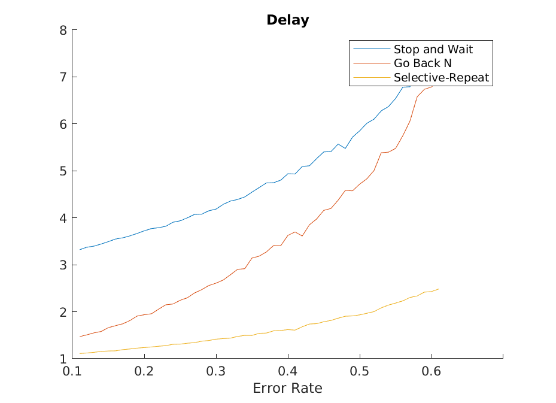
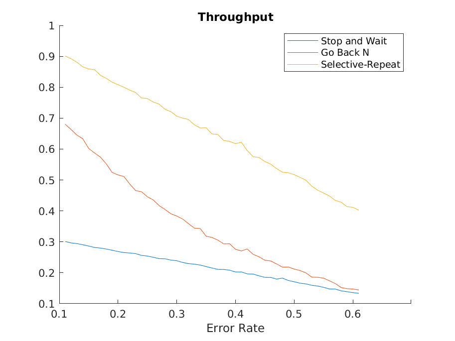
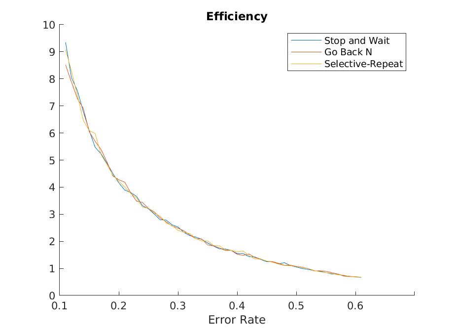

Calvin Passmore

ECE 6600

# Lab 2

The efficiency of all the ARQ's were relatively identical, and this is expected because they are using the same error rates.

They delay of the ARQ's get progressively better, with Stop and Wait being the slowest, Go Back N being close to Stop and Wait at high error rates, and Selective repeat staying at a relatively low delay.

They throughput of the ARQ's get progressively better as well. Stop and Wait stays generally bad, Go Back N goes from not the worst to pretty bad at high error rates, and Selective-Repeat does get worse, bet at a better slope than Go Back N






```matlab
%% Global Variables
error_start = 0.1;
error_stop = 0.6;
error_step = 0.01;
num_successes = 10000;

%% Stop and Wait

saw_delay = zeros(0); % Will count how many total time over sucesses
saw_throughput = zeros(0); % Count how many successes over time
saw_efficiency = zeros(0); % Number of sucessful packets vs total packets

for error_rate=error_start:error_step:error_stop
    saw_successful = 0;
    saw_failed = 0;
    saw_transmission_count = 0;
    while (saw_successful < num_successes)
        saw_transmission_count = saw_transmission_count + 1;
        success = rand();
        if success > error_rate
            saw_successful = saw_successful + 1;
        else
            saw_failed = saw_failed + 1;
        end
    end
    saw_delay(end + 1) = (saw_transmission_count * 3) / saw_successful;
    saw_throughput(end + 1) = saw_successful / (saw_transmission_count * 3);
    saw_efficiency(end + 1) = saw_successful / saw_failed;
end

%% Go Back N
window_size = 3;

GBN_delay = zeros(0);
GBN_throughput = zeros(0);
GBN_efficiency = zeros(0);
GBN_transmission = zeros(1,(window_size - 1)); % will hold floats of success

for error_rate=error_start:error_step:error_stop
    GBN_success = 0;
    GBN_failed = 0;
    GBN_transmission_count = 0;
    while (GBN_success < num_successes)
        GBN_transmission_count = GBN_transmission_count + 1;
        GBN_transmission(end + 1) = rand();
        next_in_window = GBN_transmission(1);
        GBN_transmission(1) = [];
        if next_in_window < error_rate
            GBN_failed = GBN_failed + 1;
            GBN_transmission = [];
            for i=1:window_size
                GBN_transmission_count = GBN_transmission_count + 1;
                GBN_transmission(i) = rand();
            end
        else
            GBN_success = GBN_success + 1;
        end
    end
    GBN_delay(end + 1) = GBN_transmission_count / GBN_success;
    GBN_throughput(end + 1) = GBN_success / GBN_transmission_count;
    GBN_efficiency(end + 1) = GBN_success / GBN_failed;
end

%% Selective Repeat

sr_delay = zeros(0);
sr_throughput = zeros(0);
sr_efficiency = zeros(0);
sr_transmission_count = 0;
sr_window = [];
for i=1:window_size % start the window
    sr_window(end + 1) = rand();
    sr_transmission_count = sr_transmission_count + 1;
end

for error_rate=error_start:error_step:error_stop
    sr_successes = 0;
    sr_failures = 0;
    sr_window(end + 1) = rand();
    sr_transmission_count = sr_transmission_count + 1;
    while (sr_successes < num_successes)
        sr_transmission_count = sr_transmission_count + 1;
        sr_window(end + 1) = rand();
        next_in_window = sr_window(1);
        sr_window(1) = [];
        if next_in_window < error_rate
            sr_failures = sr_failures + 1;
        else
            sr_successes = sr_successes + 1;
        end
    end
    sr_delay(end + 1) = sr_transmission_count / sr_successes;
    sr_throughput(end + 1) = sr_successes / sr_transmission_count;
    sr_efficiency(end + 1) = sr_successes / sr_failures;
end


%% Plots

fig = figure();
hold on
plot(saw_delay)
plot(GBN_delay)
plot(sr_delay)
legend(["Stop and Wait", "Go Back N", "Selective-Repeat"])
title("Delay")
xticklabels(["0.1", "0.2", "0.3", "0.4", "0.5", "0.6"])
xlabel("Error Rate")
saveas(fig, "Delay.png", 'png')

fig = figure();
hold on
plot(saw_throughput)
plot(GBN_throughput)
plot(sr_throughput)
legend(["Stop and Wait", "Go Back N", "Selective-Repeat"])
title("Throughput")
xticklabels(["0.1", "0.2", "0.3", "0.4", "0.5", "0.6"])
xlabel("Error Rate")
saveas(fig, "Througput.png", 'png')

fig = figure();
hold on
plot(saw_efficiency)
plot(GBN_efficiency)
plot(sr_efficiency)
legend(["Stop and Wait", "Go Back N", "Selective-Repeat"])
title("Efficiency")
xticklabels(["0.1", "0.2", "0.3", "0.4", "0.5", "0.6"])
xlabel("Error Rate")
saveas(fig, "Efficiency.png", 'png')

close('all')
```