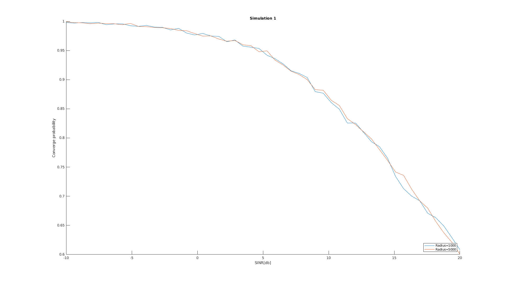
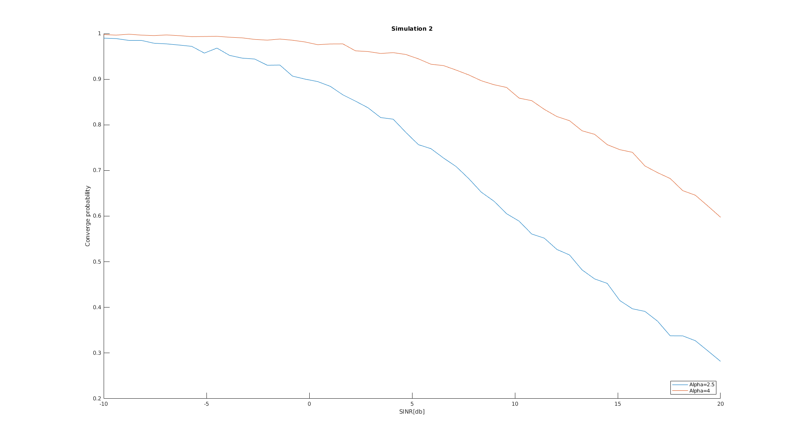
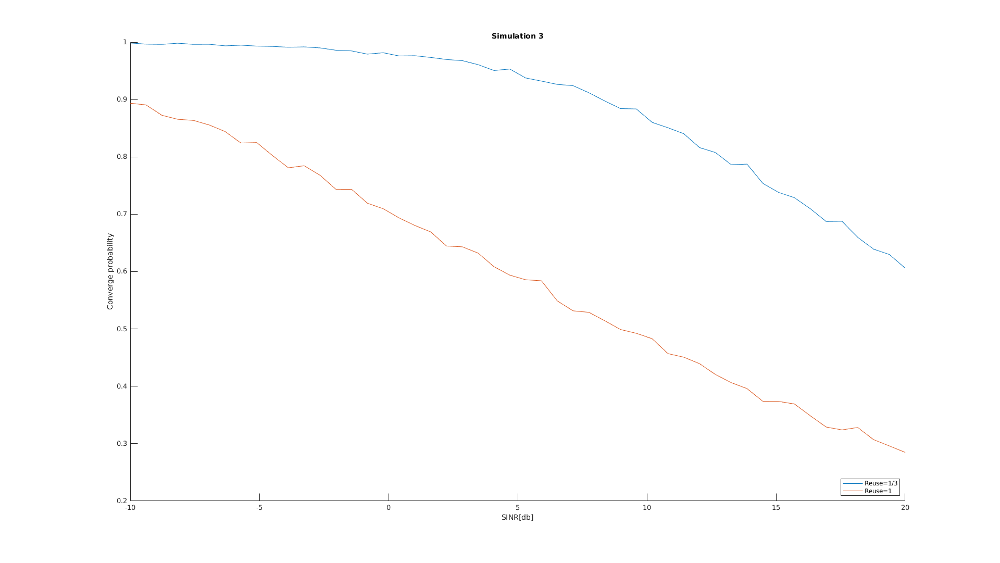

Calvin Passmore

ECE 6600

# Lab 3

Here are the results for my simulation. They are a little spiky, which could have been fixed by running the simulation more times than 5000.







This is the function that coordinates changing the paramters and plotting

```m
%% Lab 3

P = 10^((16 + 30)/10); %dBw to decimal
N0 = 10^((-114 - 30)/10); %dBm to decimal
target_SINR_db = linspace(-10, 20, 50);

%% Simulation 1
alpha = 4;
reuse = 1/3;

radius = 1000;
results1 = simuation(radius, reuse, N0, P, alpha, target_SINR_db);

radius = 5000;
results2 = simuation(radius, reuse, N0, P, alpha, target_SINR_db);

plot_results(results1, results2, target_SINR_db, ["Radius=1000","Radius=5000"], "Simulation 1");

%% Simulation 2

radius = 1000;
reuse = 1/3;

alpha = 2.5;
results1 = simuation(radius, reuse, N0, P, alpha, target_SINR_db);

alpha = 4;
results2 = simuation(radius, reuse, N0, P, alpha, target_SINR_db);

plot_results(results1, results2, target_SINR_db, ["Alpha=2.5","Alpha=4"], "Simulation 2");

%% Simulation 3

radius = 1000;
alpha = 4;

reuse = 1/3;
results1 = simuation(radius, reuse, N0, P, alpha, target_SINR_db);

reuse = 1;
results2 = simuation(radius, reuse, N0, P, alpha, target_SINR_db);


plot_results(results1, results2, target_SINR_db, ["Reuse=1/3","Reuse=1"], "Simulation 3");
```

Function that runs the simulation steps

```m
%% Simulating with given factors

function results = simuation(radius, reuse, N0, P, alpha, target_SNR_dB)
    num_stations = 7;
    base_stations = get_base_stations(radius, reuse);
    disp(base_stations)
    
    num_sim = 5000;
    results = zeros(1, length(target_SNR_dB));
    
    for index = 1:length(target_SNR_dB)
        %sum_of_sims = 0;
        num_above = 0;
        for n = 1:num_sim
            % Randomize the position of the user, and calulate the distances to each BS
            r = rand(1)*radius;
            theta = rand(1)*2*pi;
            user = [r*cos(theta) r*sin(theta)];
            distances = zeros(1,num_stations);
            for bs = 1:num_stations
                distances(bs) = sqrt((base_stations(bs,1) - user(1))^2 + (base_stations(bs,2) - user(2))^2);
            end
    
            % Get the approximate SINR
            h = exprnd(1);
            numerator = h * distances(1)^(-alpha) * P;
            g = exprnd(1);
            denominator = sum(g .* distances(2:end).^(-alpha) .* P) + N0;
            %disp(denominator)
            SINR = numerator / denominator;
            %disp(SINR)
            SINR_dB = (10 * log10(SINR)); % Convert to dB

            if SINR_dB >= target_SNR_dB(index)
                num_above = num_above + 1;
            end

            %sum_of_sims = sum_of_sims + erf(SINR/target_SNR_dB(index));
        end
        results(index) = num_above/num_sim;
    end
end
```

Function that determines base station locations

```m
function base_stations = get_base_stations(radius, reuse)
    if reuse == 1/3
        base_stations = [
            [0 0]
            [ radius*3 0]
            [-radius*3 0]
            [ radius*3*cos(60)  radius*3*sin(60)]
            [ radius*3*cos(120) radius*3*sin(120)]
            [ radius*3*cos(240) radius*3*sin(240)]
            [ radius*3*cos(300) radius*3*sin(300)]
        ];
    else
        base_stations = [
            [0 0]
            [ 1.5*radius  0.5*sqrt(3)*radius]
            [ 1.5*radius -0.5*sqrt(3)*radius]
            [-1.5*radius  0.5*sqrt(3)*radius]
            [-1.5*radius -0.5*sqrt(3)*radius]
            [0  2*radius/sqrt(3)]
            [0 -2*radius/sqrt(3)]
        ];
    end
end
```

And finally the function for convenient plotting

```m
function plot_results(results1, results2, x_axis, the_legend, the_title)
    figure();
    hold on
    plot(x_axis, results1)
    plot(x_axis, results2)
    title(the_title)
    legend(the_legend, 'Location', 'southeast')
    xlabel("SINR[db]")
    ylabel("Converge probability")
end
```